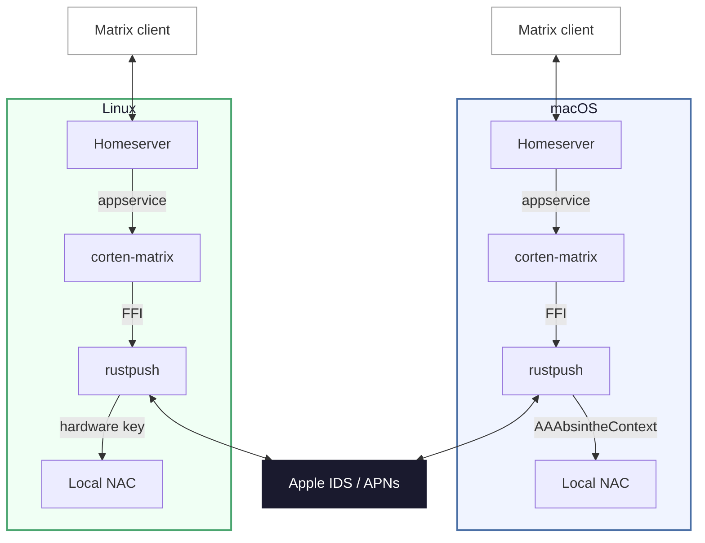

# Corten-Matrix

> **NEW** This branch has breaking changes! Corten-Matrix now ships as **prebuilt binaries**, and moving to them requires a clean reinstall and a fresh backfill, and on Linux, a new key [extraction](#step-1-extract-hardware-key-one-time-on-a-mac) with a new [tool](https://github.com/lrhodin/corten-matrix/tree/2d3e3f5ac7fd312a23993c9083df2d6dba2495ef/tools) — see [Upgrading to binary releases](#upgrading-to-binary-releases) before you update.

A Matrix–iMessage puppeting bridge built on [rustpush](https://github.com/OpenBubbles/rustpush) — like its namesake steel, the oxidation is the protective layer. Send and receive iMessages from any Matrix client.

This is the **v2** rewrite using [rustpush](https://github.com/OpenBubbles/rustpush) and [bridgev2](https://mau.fi/blog/megabridge-twilio/) — it connects directly to Apple's iMessage servers without SIP bypass, Barcelona, or relay servers.

**Features**: text, images, video, audio, files, reactions/tapbacks, edits, unsends, typing indicators, read receipts, group chats, SMS forwarding, contact name resolution, **FaceTime calls** (web join links — works from non-Apple platforms), **iOS 18 Focus / Do Not Disturb status** for contacts, **iCloud Shared Albums**, and **Name & Photo Sharing** fallback for unknown senders.

**Platforms**: macOS (full features) and Linux (via a hardware key extracted from a Mac once). On Linux, the Mac is needed **only** for the one-time key extraction — there is no relay or background process running on the Mac at runtime. Please note, Contact Key Verification must be disabled for the bridge to function — see [Troubleshooting](#troubleshooting).

## How it's distributed

Corten-Matrix ships as a **prebuilt, self-contained binary** called `corten-matrix`, downloaded from the [Releases page](https://github.com/lrhodin/corten-matrix/releases). The binary *is* the bridge **and** its management CLI — there is **nothing to compile** and no first-run build step. The native pieces the bridge needs are already baked into the release, so you download one file, mark it executable, and run it.

**Building from source is supported on macOS.** On a Mac the bridge generates its own validation data through Apple's native `AAAbsintheContext` framework, so it builds and runs entirely from this repository — see [Build from source (macOS)](#build-from-source-macos). The prebuilt binary releases remain the easy path (no toolchain to set up) and are the only way to run on **Linux**.

> **Docker is deprecated for the time being.** While we move to binary distribution there is no maintained Docker image; run the native binary directly via `corten-matrix setup` / `setup-beeper`. Docker support may return in a later release.

After downloading the binary you run `corten-matrix setup` (self-hosted) or `corten-matrix setup-beeper` (Beeper), which installs the runtime dependencies, walks you through configuration, logs you in, and installs the background service. See [The `corten-matrix` CLI](#the-corten-matrix-cli) for the full command list.

## Upgrading to binary releases

Corten-Matrix previously expected you to build from source. The binary releases are a clean break and rebrand to the corten-matrix name, so an in-place upgrade is **not** supported — you need to reinstall:

1. **Reinstall from the binary.** Download `corten-matrix` from the [Releases page](https://github.com/lrhodin/corten-matrix/releases), rename it if desired, make it executable: `chmod +x corten-matrix`, and run `corten-matrix setup` (or `setup-beeper`). Treat this as a fresh install rather than an upgrade of an existing source checkout.
2. **Re-run backfill.** History must be re-backfilled on the new install; your previous database is not carried forward. CloudKit backfill runs from the binary the same way it did before — see [Receiving messages](#receiving-messages).
3. **Linux only — re-extract your hardware key.** The legacy NAC relay is gone (see [Quick Start (Linux)](#quick-start-linux)); the binary releases require a **new** key extraction done with the current extractor tool. Old keys and any relay setup will not work — extract fresh.

If you're a brand-new user, ignore this section and follow the Quick Start for your platform.

## Quick Start (macOS)

macOS 13+ required (Ventura or later). Sign into iCloud on the Mac running the bridge (Settings → Apple ID) — this lets Apple recognize the device so login works without 2FA prompts.

> **Registering on a real Mac vs. Linux.** On macOS the bridge registers itself **natively** — validation data is generated on the spot by Apple's own frameworks, so there's **no key to extract**; just sign in. Extracting a hardware key (with an Intel or Apple Silicon Mac — same tool) is only for running the bridge on **Linux**; see [Quick Start (Linux)](#quick-start-linux).

1. Download the `corten-matrix` binary for macOS from the [Releases page](https://github.com/lrhodin/corten-matrix/releases) and make it executable (`chmod +x corten-matrix`). Rename said binary if desired. The platform and architecture name is appended to distinguish between releases. macOS is a universal binary.
2. Run setup:

   ```bash
   # Beeper
   ./corten-matrix setup-beeper

   # …or a self-hosted homeserver
   ./corten-matrix setup
   ```

`setup` auto-installs Homebrew and dependencies if needed, walks you through homeserver URL / domain / Matrix ID / database choice and a few feature toggles (CloudKit backfill, FaceTime Bridge, StatusKit notifications, external CardDAV, HEIC conversion, video transcoding), generates config files, handles iMessage login, and starts the bridge as a LaunchAgent. For a self-hosted homeserver it will pause and tell you exactly what to add to your `homeserver.yaml` to register the bridge. You can re-run `corten-matrix setup` any time to flip these toggles without wiping your data — see [Reconfiguring without editing YAML](#reconfiguring-without-editing-yaml).

`setup` also offers to symlink `corten-matrix` into `/usr/local/bin` so it's on your `PATH`; after that you can drop the `./` and run `corten-matrix <command>` from anywhere.

## Quick Start (Linux)

The bridge runs on Linux using a hardware key extracted once from a real Mac. **No Mac is needed at runtime** — a Mac (Intel or Apple Silicon, same tool either way) is used only for the one-time key extraction in Step 1, after which it can go back to normal use.

> **The NAC relay is deprecated.** Earlier versions could keep a relay process running on a Mac to answer validation requests. The binary releases drop that entirely: the key is **fully enriched at extraction time**, so nothing runs on the Mac afterward. If you previously used the relay, it no longer applies — perform a **fresh extraction** with the current tool (below). Old keys from the pre-binary era **must** be re-extracted.

### Prerequisites

Ubuntu 22.04+ (or equivalent). The setup step installs the runtime dependencies for you across the common package managers (apt / dnf / pacman / zypper / apk). Nothing is compiled on your machine — the bridge binary is prebuilt.

Containers are supported: in an LXC container (or anywhere `systemctl --user` has no session bus — e.g. running as root, or SSH without lingering), setup automatically installs the service as a **system** unit instead of a user unit. See the note under [Management → Linux](#linux).

### Step 1: Extract hardware key (one-time, on a Mac)

Run the extractor on **any** Mac — Intel or Apple Silicon, it's the same tool and both produce an equivalent key. The key is fully enriched at extraction time, so there's nothing to post-process and **no relay to keep running** afterwards. The Mac is not modified and can continue to be used normally.

> Use the extractor tools linked below — extractors from before the binary switch are not compatible.

**Option A — GUI app (recommended).** Download the hardware-key [extractor app](https://github.com/lrhodin/corten-matrix/blob/d9fed308b33a03019fd4273a6921a0a5bf818564/tools/ExtractKey.app.zip), copy it to the Mac, and launch it. It reads the hardware identifiers, displays them, and lets you **Copy** or **Save** the base64 key.

> **Gatekeeper**: The app is ad-hoc signed (not notarized — just a fact of macOS), so a downloaded copy is blocked on first launch:
>
> - **macOS 13+ (Ventura)**: Double-click it, then go to **System Settings → Privacy & Security**, scroll down, and click **Open Anyway**.
> - **macOS 10.15–12**: Right-click (or Control-click) the app and choose **Open** from the context menu, then **Open** in the dialog.
> - **Terminal**: Run `xattr -cr <AppName>.app` to strip the quarantine flag, then double-click normally.

**Option B — CLI (fallback).** If you'd rather not use the GUI, download the [command-line extractor](https://github.com/lrhodin/corten-matrix/blob/d9fed308b33a03019fd4273a6921a0a5bf818564/tools/extract-key-cli.zip), run it on the Mac, and copy the base64 key it prints:

```bash
chmod +x extract-key
./extract-key
```

Either option produces the same base64 hardware key. Keep it handy for Step 3.

### Step 2: Install the bridge (on Linux)

Download the `corten-matrix` binary for your architecture (`linux-amd64` or `linux-arm64`) from the [Releases page](https://github.com/lrhodin/corten-matrix/releases), rename it if desired, and make it executable, and run setup:

```bash
chmod +x corten-matrix

# Beeper
./corten-matrix setup-beeper

# …or a self-hosted homeserver
./corten-matrix setup
```

For self-hosted, setup walks you through homeserver URL → domain → Matrix ID → database choice, then the iMessage login. Nothing compiles — the binary is ready to run immediately.

### Step 3: Login

`setup` detects that no login exists and runs the iMessage login flow inline at the end. You're prompted right there in the terminal for:

1. Your hardware key (paste the base64 from Step 1)
2. Your Apple ID and password
3. The 2FA code sent to your trusted devices

When the script finishes you're already logged in and the bridge is up.

**Alternative: log in through the bridge bot.** If you ever need to log in (or log back in) outside the setup flow, DM the bridge bot in the Matrix management room and run the **"Apple ID (External Key)"** login flow there — same three prompts, same result. You can also re-run the terminal flow at any time with `corten-matrix login`.

## The `corten-matrix` CLI

The `corten-matrix` binary is both the bridge and its management CLI — it replaces the old Makefile targets and platform-specific `launchctl` / `systemctl` incantations. Run `corten-matrix help` for the list:

| Command | What it does |
|---|---|
| `corten-matrix setup` | Configure and start the bridge against a self-hosted homeserver. Idempotent — re-run to flip feature toggles. |
| `corten-matrix setup-beeper` | Same, but configured for Beeper. |
| `corten-matrix setup 1` / `setup-beeper 1` | Add a **second** iMessage account (a different Apple ID), or reconfigure an existing one later — the same prompts as `setup`, scoped to the second bridge. |
| `corten-matrix start` / `stop` / `restart` | Control the running bridge service (launchd on macOS, systemd on Linux). One service runs both accounts. |
| `corten-matrix status` | Show the service status. |
| `corten-matrix logs 1` | Tail the live bridge log; `1` = second account. |
| `corten-matrix login` | Re-run the interactive iMessage login (Apple ID + password + 2FA, or hardware key on Linux). |
| `corten-matrix install-service` / `uninstall-service` | Install or remove the background service without re-running full setup (`corten-matrix uninstall` is an alias of `uninstall-service`). |
| `corten-matrix reset` | Rebuild local bridge state and, on Beeper, the remote registration; Apple/iMessage state is preserved unless explicitly deleted — see [Reset and duplicate-room recovery](#reset-and-duplicate-room-recovery). |
| `corten-matrix update` | **Official binary releases only.** Update in place to the latest release and restart — see [Updating](#updating). |
| `corten-matrix update check` / `update force` | `check` previews the latest version + release notes without installing; `force` re-downloads and reinstalls the current release. |
| `corten-matrix bbctl <args>` | Beeper bridge-manager CLI (register / auth / stop / delete the bridge in Beeper infra). |
| `corten-matrix help` | Show the command list. |

**Verified Beeper deletion.** `corten-matrix bbctl delete BRIDGE` may wait up to one minute while it checks both the Matrix appservice record and the Beeper bridge-manager registration. It prints success only after both are absent; a timeout, failed verification read, or either record remaining returns a nonzero exit, so remote cleanup must not be assumed. `setup-beeper` does not delete an existing registration implicitly, and a Beeper `reset` that cannot verify deletion stops before removing local bridge state; fix the reported authentication, network, or server error and retry the same command.

> `update` is shown by `corten-matrix help` **only on the official prebuilt binaries**. If you built from source it isn't there — update by pulling this repo and rebuilding (see [Updating](#updating)).

The same `start` / `stop` / `restart` / `status` / `logs` commands work on both platforms, so you don't have to remember whether the host uses `launchctl` or `systemctl` — the raw equivalents are in [Management](#management) if you'd rather wire your own thing.

### Dual accounts (two Apple IDs)

corten-matrix can bridge **two Apple IDs** on the same machine (max two), each as its own fully-isolated bridge — separate iMessage login/session, data dir, config, and Matrix appservice — run together under a **single** background service.

**Add or reconfigure a second account** — it's an explicit one-line command, there's no mid-setup prompt:

- **Add it any time** with `corten-matrix setup 1` (self-hosted) or `corten-matrix setup-beeper 1` (Beeper). You get the same configuration prompts and iMessage login, scoped to the second bridge.
- **Reconfigure it later** by re-running the same command — e.g. to flip a toggle like CloudKit backfill.

**How it works.** The two accounts never share login state. The first lives in `~/.local/share/corten-matrix`, the second in `~/.local/share/corten-matrix-1`. A single service runs *both* bridge processes (`bridge-all`), so `start` / `stop` / `restart` / `status` act on both at once; `corten-matrix logs` tails the first account and `corten-matrix logs 1` the second.

**macOS history-backfill caveat.** Each account backfills message history from either **CloudKit** (iCloud sync) or the local **chat.db** (the Mac's Messages database). chat.db only ever holds the messages of the *one* Apple ID signed into Messages on that Mac, so the two accounts can't both use it:

| Account 1 | Account 2 | Works? |
|---|---|---|
| CloudKit | CloudKit | ✅ |
| chat.db | CloudKit | ✅ |
| chat.db | chat.db | ❌ — only one local Messages database exists |

So **at most one** account can use chat.db backfill — the Apple ID signed into Messages on the Mac — and the other must use CloudKit. This only limits *history backfill*; real-time messaging works for both accounts regardless. (Linux has no chat.db, so both accounts always use CloudKit.)

## Updating

How you update depends on how you're running corten-matrix:

- **Official prebuilt binaries (macOS & Linux)** — run `corten-matrix update`. It pulls the latest [release](https://github.com/lrhodin/corten-matrix/releases) for your platform (macOS universal, Linux amd64, or Linux arm64), replaces the installed binary in place, prints the release notes, and restarts the bridge. Your config, login, and data are untouched.

  ```bash
  corten-matrix update          # update & restart
  corten-matrix update check    # show what's available + release notes, change nothing
  corten-matrix update force    # re-download & reinstall the current release
  ```

  **The service must be installed first.** `update` doesn't take a path or guess where your binary lives — it locates it through the `corten-matrix` entry on your `PATH`. That entry is a symlink into `/usr/local/bin` that `corten-matrix setup` (and `install-service`) creates, pointing at wherever you actually keep the binary; `update` follows the symlink to that real file and replaces it in place, leaving the symlink intact. So you must have run `setup` / `install-service` (and added it to `PATH` when prompted) before `update` will work. If `corten-matrix` isn't on your `PATH`, `update` stops and tells you to install the service first rather than guessing. (If the binary lives somewhere only root can write, it uses `sudo` for the swap.)

- **Built from source (macOS)** — the `update` command isn't included in source builds. Update the normal way: `git pull` and rebuild (see [Build from source (macOS)](#build-from-source-macos)), then `corten-matrix restart`.

## Login

There are two ways to log in:

- **Through the setup flow (default).** `corten-matrix setup` and `corten-matrix setup-beeper` detect a missing login and run the iMessage login inline at the end. This is the path almost everyone uses — answer the prompts in the terminal and you're done.
- **Through the bridge bot (alternative).** DM the bot in the Matrix management room and run the **"Apple ID (External Key)"** login flow. Useful if you skipped the setup login step, want to switch handles, or are re-logging without re-running setup. `corten-matrix login` re-runs the terminal flow.

Either path follows the same prompts: Apple ID → password → 2FA (if needed) → handle selection. On macOS, if the Mac is signed into iCloud with the same Apple ID, login completes without 2FA. On Linux, you additionally paste the hardware key from [Step 1](#step-1-extract-hardware-key-one-time-on-a-mac).

If your Apple ID has multiple identities registered (e.g. a phone number and an email address), you'll be asked which one to use for outgoing messages. This is what recipients see your messages "from". To change it later, set `preferred_handle` in the config (see [Configuration](#configuration)) or log in again.

### SMS Forwarding

To bridge SMS (green bubble) messages, enable forwarding on your iPhone:

**Settings → Messages → Text Message Forwarding** → toggle on the bridge device.

### Receiving messages

Incoming iMessages automatically create Matrix rooms. History backfill uses **CloudKit** by default — that's the modern, supported path and what almost everyone should pick.

**Local chat.db** (`backfill_source: chatdb`) is a last-resort fallback for older macOS versions that can't run CloudKit backfill at all. If your Mac is in that bucket, the **preferred workaround is to run the bridge on Linux instead** (extract the hardware key once via [Quick Start (Linux)](#quick-start-linux), then let the Linux bridge do CloudKit backfill normally). Only choose `chatdb` if you actually have to run the bridge on a legacy Mac and Linux isn't an option — it's macOS-only and requires **Full Disk Access** (System Settings → Privacy & Security → Full Disk Access → add the bridge binary or Terminal) to read `~/Library/Messages/chat.db`. Without FDA the bridge can't read the file and chat.db backfill silently does nothing.

## Bridge commands

In the **management room** (the bot DM, opened automatically when you log in), type commands bare — no prefix:

```
start-chat
help
logout
```

In **portal rooms** (any bridged DM or group), prefix commands with `!im`:

```
!im facetime
!im help
```

To abort an interactive command (a picker waiting for your reply), type `cancel` in the management room or `!im cancel` in a portal.

### Common commands

| Command | What it does |
|---|---|
| `start-chat` | Open a new iMessage DM. With no arguments, the bot walks you through phone vs. email and explains the country-code format. With an argument (`start-chat +15551234567` or `start-chat someone@icloud.com`) it skips the picker. |
| `contacts` | Search your synced contacts by name (iCloud, external CardDAV, or local macOS Contacts depending on `backfill_source` and `carddav` settings) and reply with a number to open a chat. Different from `start-chat` — use this when you don't remember the number/email. Alias: `find`. |
| `restore-chat` | List iMessage chats in the recycle bin. Reply with a number to bring one back, including its history. |
| `logout` | Sign out of iMessage. Lists active handles, you reply with a number (or `all`). The bot then walks you through the manual step at `appleid.apple.com → Devices` to fully revoke the bridge from Apple's servers. |
| `help` | Full command list, grouped by section. |

### Phone-number format for `start-chat`

Always include the country code with a leading `+`. Spaces, dashes, and parentheses are stripped automatically; you don't need to type `tel:` / `mailto:` prefixes either.

| Country | Format |
|---|---|
| USA / Canada | `+1 555 123 4567` |
| UK | `+44 20 7946 0958` |
| France | `+33 1 23 45 67 89` |
| India | `+91 98765 43210` |

A bare US number (`5551234567`) won't work — the country code is required. Look up codes at <https://countrycode.org>.

### Logging out

`logout` does the bridge-side teardown automatically — disconnects from Apple, removes the login from the bridge, kicks you from portals, and wipes the local session backup so a re-login starts from a clean slate.

The bridge has no API to deregister your IDS identity from Apple, so the success message walks you through the final step:

1. Sign in at <https://appleid.apple.com>.
2. Go to **Devices**.
3. Find the entry for the bridge (often shown as a Mac, sometimes named "Apple Device").
4. Click **Remove from account**.

Until you do step 4, Apple still considers the bridge a registered iMessage device.

## FaceTime

> **Who this is for**: Matrix users on **Android, Windows, and Linux** who don't have an Apple device to take FaceTime calls on. The bridge places and receives FaceTime calls through Apple's web client (which runs in any modern browser on those platforms). If you already own a Mac or iPhone signed into the same Apple ID, the call rings on your Apple device natively and the bridge's web-join wrapper just clutters the chat — see [Opting out](#opting-out) below.

### In a 1:1 portal

```
!im facetime
```

Rings the contact and posts a "🌐 Join FaceTime call" notice in the portal. Tap the link on your Android / Windows / Linux Matrix client to open Apple's FaceTime web client in a browser and join the call. The contact's iPhone or Mac shows it as a normal incoming FaceTime, and they can answer wherever they like.

In a **group** portal, `!im facetime` doesn't ring anyone — the outgoing-call flow targets a single contact only, so the command falls back to posting a plain join link for participants to open themselves.

When a contact rings **you**, the bridge posts "📞 **Incoming FaceTime call from {name}.**" in the DM portal with an **Answer FaceTime call** link that opens the FaceTime web client in your browser. Missed calls show up as a notice with a **Call back {name}** button (taps re-ring the contact through the bridge); "answered on another device" surfaces as a one-line passive notice. The bridge keeps a persistent ghost in the room used for FaceTime signalling — that's expected, leave it in place.

### Other commands

| Command | What it does |
|---------|-------------|
| `facetime-send` | Generate a link and deliver it as an iMessage to the contact (no Matrix message). |
| `facetime-clear` | Revoke every bridge-created FaceTime link so the next `facetime` mints a fresh one. |
| `facetime-invalidate-peer` | Force the peer's device to drop its cached bridge identity. Use when calls intermittently come through as audio-only. |
| `facetime-rotate-identity` | Re-register the bridge's IDS identity (heavier than the per-peer invalidate). |
| `facetime-letmein` / `facetime-letmein-approve` / `facetime-letmein-deny` | List, approve, or deny pending Let-Me-In delegated-access requests. |

A full list lives under `!im help` in the **FaceTime** section.

### Display name on join links

The name pre-filled on the FaceTime web join page comes from your Apple Account. To override it, set `facetime_display_name` in `~/.local/share/corten-matrix/config.yaml`.

### Caller identity on the recipient's screen (the `temp:` UUID)

When you place a call, the person you're calling sees **your name** — but you may also notice a `temp:<uuid>` identity shown alongside it (most visibly in the call-detail card or call history). This is expected. Here's the reasoning:

A bridge FaceTime call is carried by **Apple's FaceTime web client running in your browser**, not by the bridge process itself. When your browser opens the join link, Apple's web client generates a throwaway pseudonym for that session — a `temp:<uuid>` handle — and that pseudonym *is* the browser participant's identity on the call. The bridge never creates it and has no way to rename it.

To make your name appear, the bridge stamps your display name (`facetime_display_name` → Apple Account name → your handle) onto that participant's **nickname** on the wire, so FaceTime renders your name on top. But FaceTime also shows a participant's underlying *identity* beneath the nickname, and for the web client that identity is the `temp:<uuid>`. So you'll typically see your name **twice** — once for your real IDS handle, once for the browser participant — plus that lingering pseudonym line under the latter.

Removing the `temp:<uuid>` entirely would mean replacing or pruning the browser participant from the call — but that participant is the one actually carrying your audio and video, so removing it **drops the call**. (OpenBubbles' native Android app sidesteps this by injecting the name directly into its own embedded webview; a browser-based Matrix link can't reach into Apple's page to do that.) The bridge therefore leaves the pseudonym in place: showing your name is the safe, meaningful improvement, and suppressing the last identity line isn't possible without breaking calling.

### Opting out

If you have a Mac or iPhone signed into the same Apple ID, FaceTime rings there natively — the bridge's web-join wrapper adds nothing, so you should disable it. The setup flow asks "Disable FaceTime Bridge?" both on first install and on every subsequent re-run, so you can flip this at any time without editing YAML by hand. (You can also set `disable_facetime: true` in `~/.local/share/corten-matrix/config.yaml` directly.) Disabling skips every `facetime-*` command and suppresses all inbound FaceTime notices in your Matrix portals.

## Focus & Do Not Disturb

When a contact toggles a Focus mode (Do Not Disturb, Sleep, Work, etc.) on iOS 18+, the bridge marks it on the **chat title** — appending a 🌙 to the contact's name (e.g. "Alice 🌙") while their Focus/DND is on, and removing it when they turn it off:

- The 🌙 rides on the DM's name (a room-state change, updated in place), not a posted message — so it never bumps or unarchives the chat, and there's no timeline spam.
- The contact's Matrix ghost also gets a presence update, so clients that render presence reflect the same state.
- DM-only: a group has a single shared title, so per-member Focus can't ride on it.
- Focus is a global on/off and not per contact.

This is the closest analog to the moon Apple shows next to a name. The bridge announces itself as "available" once after startup so peer iPhones reciprocate with the key material needed to decrypt their subsequent presence updates — leave `statuskit_share_on_startup: true` for the best chance of seeing contacts' Focus state.

If you'd rather not see the indicator (or you already track Focus on another Apple device), the setup flow asks "Enable StatusKit notifications?" on first install and on every subsequent re-run, so you can flip it at any time. (Or set `statuskit_notifications: false` in `~/.local/share/corten-matrix/config.yaml`.) Disabling suppresses the 🌙 indicator and presence updates while keeping the underlying StatusKit registration intact.

## Shared Albums

iCloud Shared Albums (Photo Streams) you subscribe to surface as dedicated rooms with the album's photos and videos backfilled. Use:

| Command | What it does |
|---------|-------------|
| `shared-albums` | Browse available Shared Albums; pick one, then pick assets to download. |
| `shared-subscribe <album-id>` | Subscribe to a Shared Album by ID so the bridge watches it for new assets. |
| `shared-subscribe-token <token>` | Subscribe via the one-time invitation token from an iCloud share URL (`icloud.com/sharedalbum/...`). |
| `shared-unsubscribe <album-id>` | Unsubscribe from an album so the bridge stops watching it. |
| `shared-state` | Dump current Shared Streams state as JSON (debugging). |

A full list lives under `!im help` in the **Shared Streams** section.

## Image and video conversion

The bridge converts a handful of formats automatically so attachments render in Matrix clients and reach iMessage in formats Apple's clients accept. Two behaviours are gated on opt-in toggles; the rest run unconditionally.

### Always on, both directions

- **TIFF ↔ JPEG.** TIFF is re-encoded to JPEG at quality 95 in either direction.
- **Opus voice notes.** iMessage uses Opus in Apple's CAF container; Matrix clients use Opus in an OGG container. The bridge remuxes between the two (no re-encoding — same codec, different wrapper) in either direction.

### Always on, outgoing only

- **Other non-JPEG images → JPEG** at quality 95. PNG and similar formats sent from Matrix are re-encoded before being handed to iMessage; the Matrix event is also edited in place so other Matrix clients see the corrected file. Incoming PNG passes through unchanged.

### Opt-in, incoming only

- **HEIC / HEIF → JPEG** — gated on `heic_conversion` (default off). Decoded with `libheif`, re-encoded at `heic_jpeg_quality` (default `95`, clamped to 1–100). EXIF, ICC color profile, and XMP are preserved; orientation is normalised because `libheif` applies the rotation during decode. Animated / multi-image HEICs collapse to the primary frame with a warning. With the toggle off, HEIC bytes pass through to Matrix — modern clients (Element, Beeper) render them, older clients may not.
- **Non-MP4 video → MP4** — gated on `video_transcoding` (default off). Applies to any `video/*` MIME that isn't already `video/mp4` (`.mov`, `.m4v`, MKV, AVI, WebM, …). The bridge tries a stream-copy remux first (`ffmpeg -c copy -movflags +faststart`) — fast and lossless. If that fails, it falls back to a full re-encode (H.264 `-preset fast -crf 23` plus AAC). Audio tracks are preserved in both modes. The Matrix event ends up as `.mp4` / `video/mp4`.

### Live Photos

iMessage Live Photos arrive as a HEIC still + MOV pair. The still goes through HEIC conversion if `heic_conversion` is on; the MOV goes through video transcoding if `video_transcoding` is on. Both pieces are delivered to Matrix as adjacent messages.

### Size limit

Attachments larger than `max_attachment_size_mb` (default `100`) are **skipped entirely** — never downloaded, transcoded, or uploaded. The default matches Beeper's upload cap: the homeserver rejects anything bigger, so bridging it would only waste a download (the bytes buffer in memory while fetching), a doomed transcode, and disk — all for a guaranteed rejection, and a multi-GB attachment can exhaust RAM on a small host. CloudKit occasionally surfaces very large attachments (multi-GB videos); skipping them up front keeps a backfill from stalling on files that could never land anyway. Self-hosters whose homeserver accepts larger uploads can raise the cap — see [`max_attachment_size_mb`](#key-options), including the note about needing the RAM for it.

### Dependencies

- **`libheif`** is a runtime dependency the bridge links against. `corten-matrix setup` installs it via Homebrew (macOS) or `apt`/`dnf`/`pacman`/`zypper`/`apk` (Linux), regardless of whether `heic_conversion` is enabled.
- **`ffmpeg`** is required at runtime only when `video_transcoding` is enabled. The setup flow installs it via the same package manager when you turn the toggle on during the interactive prompts.

## How It Works

The bridge connects directly to Apple's iMessage servers using [rustpush](https://github.com/OpenBubbles/rustpush) with **local NAC validation** — no SIP bypass, no relay server, and no background process on a Mac. When `backfill_source: chatdb` is set on macOS, it additionally reads `~/Library/Messages/chat.db` for backfill and uses the local Contacts framework for name resolution; the default CloudKit path uses iCloud for both.

NAC validation runs entirely in-process on the host running the bridge:

- **macOS**: validation data is generated natively through Apple's own `AAAbsintheContext` framework.
- **Linux**: validation data is generated locally from the hardware key extracted once from a Mac. The key carries everything needed, so no Mac is involved at runtime — Intel and Apple Silicon keys both work the same way, with no relay.



### Real-time and backfill

**Real-time messages** flow through Apple's push notification service (APNs) via rustpush and appear in Matrix immediately.

**CloudKit backfill** (optional, off by default) syncs your iMessage history from iCloud on first login. Enable it during `corten-matrix setup` or by setting `cloudkit_backfill: true` in config. When enabled, the login flow will ask for your device PIN to join the iCloud Keychain trust circle, which grants access to Messages in iCloud.

On the **first** install (before the bridge database exists), setup asks whether you want to cap messages per chat:

- Answer **no** and every available message is backfilled.
- Answer **yes** and pick a per-chat limit (minimum 100).

The cap can't be changed on later re-runs once the database is in place — edit `~/.local/share/corten-matrix/config.yaml` directly to change it.

## Privacy

The bridge's design goal is the same as every other bridgev2 bridge: **message content lives in Matrix, and the bridge's own database holds only the routing metadata needed to correlate messages, edits, reactions, and deletes.** The bridgev2 `message` table never had a body column to begin with — it stores IDs, timestamps, and sender references, nothing else.

The one place this bridge has to deviate is **CloudKit backfill**. To turn your iCloud message history into Matrix events, the sync pipeline stages pulled messages — with their plaintext bodies — in a local `cloud_message` cache. That cache is the only spot where message bodies touch disk, and the privacy layer exists to clean it back down to metadata after delivery. (The `chatdb` backfill source never stores bodies at all — it reads `~/Library/Messages/chat.db` live at query time. If you don't enable CloudKit backfill, none of the below applies; no bodies are ever cached.)

### How scrubbing works

A periodic scrubber (every 5 minutes) NULLs the plaintext columns — `text`, `subject`, `sender`, `tapback_emoji` — on `cloud_message` rows, gated by two conditions:

- **Already delivered to Matrix.** A row is only scrubbed once its GUID has a corresponding row in bridgev2's `message` table (i.e. the message reached Matrix), *or* it was deleted/unsent. A message that hasn't bridged yet is never scrubbed — bridging always comes first, so the scrubber can never blank a message out from under the backfill pipeline.
- **Past a 5-minute grace window.** Freshly-ingested rows get a buffer (keyed on last-ingest time) so the backfill pipeline has time to read the body before scrubbing clears it.

Scrubbing the local cache is not data loss: the canonical copy of every message stays in Messages in iCloud on Apple's servers. The `cloud_message` table is only a staging cache for backfill, never the source of truth.

On SQLite, the bridge also sets `_secure_delete=on` for every pooled connection, so the freed pages holding the old plaintext are zeroed rather than left readable on disk. This is SQLite-only; on Postgres the columns are NULLed identically, but scrubbed bytes sit in dead tuples until a routine `VACUUM` reclaims them (the bridge does not run `VACUUM FULL` automatically).

Message **deletes and unsends** scrub the cached body right away — not waiting for the periodic tick — and are fail-closed. For inbound (Apple-side) deletes and unsends, a scrub failure makes the bridge skip emitting the Matrix removal, so the row stays scrub-eligible rather than leaking plaintext. For outbound (Matrix-initiated) redactions, the scrub failure is reported back to the framework so it won't drop its own message row before the body is cleared. The row itself is kept (soft-deleted, body NULLed) for echo detection — it isn't removed from the cache.

### Logs

In the bridge's own connector code, raw iMessage handles (phone numbers, email addresses) and full URLs are not written to logs: handles are replaced with a stable, non-reversible token (SHA-256 → UUID form) so you can still correlate one person across log lines without recording the PII, and URLs are reduced to scheme+host. This is anonymization at the log-write boundary — the values used for routing, handle matching, and StatusKit alias resolution are always the real ones, so functionality is unaffected.

**Caveat:** this covers log lines emitted by this connector (`pkg/connector`). The underlying bridgev2 framework emits its own logs and can still print raw handles/identifiers in its messages — those are outside the connector's control. So "anonymized logs" means the connector's own output, not a guarantee across every line in the file.

### What is *not* scrubbed (by design)

- **Attachment metadata** (`attachments_json`) — filenames, MIME types, sizes, and CloudKit record-names. The record-name is required to re-pull a file from Apple if a Matrix upload fails after bridging. The attachment *bytes* live in CloudKit, not the DB.
- **Chat metadata** (`cloud_chat`) — group display names and participant handles, kept so a conversation's identity (name, members) survives across re-syncs without a refetch.

### Debugging

Everything above is on by default and has no config toggle. The single escape hatch is `debug_disable_privacy` (see [Key options](#key-options)) — a development-only switch that turns off log anonymization and the scrubber and re-fills previously-scrubbed plaintext on the next sync. Leave it `false` in any real deployment.

## Management

The `corten-matrix` CLI is the easy path — `corten-matrix start | stop | restart | status | logs` work the same on both platforms. The raw equivalents (and other knobs) are below if you'd rather wire your own thing.

### macOS

```bash
# View logs — bridge.log is structured JSON; `corten-matrix logs` renders it readably
tail -f ~/.local/share/corten-matrix/logs/bridge.log            # first account (raw JSON)
tail -f ~/.local/share/corten-matrix-1/logs/bridge.log          # second account, if configured
tail -f ~/.local/share/corten-matrix/logs/bridge.stdout.log     # raw process stdout + crash output

# Restart (auto-restarts via KeepAlive)
launchctl kickstart -k gui/$(id -u)/com.lrhodin.corten-matrix

# Stop until next login
launchctl bootout gui/$(id -u)/com.lrhodin.corten-matrix

# Uninstall
corten-matrix uninstall
```

### Linux

```bash
# If using systemd (from corten-matrix setup / setup-beeper)
systemctl --user status corten-matrix
journalctl --user -u corten-matrix -f
systemctl --user restart corten-matrix

# In containers (LXC) — or anywhere `systemctl --user` can't reach a session bus —
# setup installs a SYSTEM unit (/etc/systemd/system/corten-matrix.service) instead; drop `--user`:
systemctl status corten-matrix
journalctl -u corten-matrix -f
systemctl restart corten-matrix

# File logs (per account; bridge.log is structured JSON — `corten-matrix logs` renders it readably)
tail -f ~/.local/share/corten-matrix/logs/bridge.log      # first account
tail -f ~/.local/share/corten-matrix-1/logs/bridge.log    # second account, if configured

# If running directly (debugging or non-systemd hosts)
./corten-matrix -c ~/.local/share/corten-matrix/config.yaml
```

You don't have to know which mode you're in: `corten-matrix start` / `stop` / `restart` / `status` detect it — they drive the user unit when a session bus is reachable and fall back to the system unit otherwise (using `sudo` when you're not root). The raw commands above are only for wiring your own tooling.

## Configuration

Config lives in `~/.local/share/corten-matrix/config.yaml` (generated during setup). Override the data directory by setting `XDG_DATA_HOME` before running setup if you want a different location.

### Reconfiguring without editing YAML

The setup commands (`corten-matrix setup` and `corten-matrix setup-beeper`) are idempotent — re-run them any time and they detect the existing config, then walk you through interactive prompts to flip individual settings. Nothing is wiped. You can use a re-run to change:

- **Preferred handle** — pick a different `tel:` / `mailto:` from the registered list
- **External CardDAV** — change email / server / app password
- **CloudKit backfill** — enable or disable, switch between CloudKit and `chat.db` sources
- **FaceTime Bridge** — enable or disable (`disable_facetime`)
- **StatusKit notifications** — enable or disable the iOS 18 Focus / DND 🌙 chat-title indicator (`statuskit_notifications`)
- **HEIC conversion / video transcoding** — toggle on or off

```bash
corten-matrix setup              # self-hosted homeserver
corten-matrix setup-beeper       # Beeper
```

The per-chat backfill cap (`backfill.max_initial_messages`) is asked only on the **first** install, before the bridge database exists. To change it later, edit `~/.local/share/corten-matrix/config.yaml` directly.

Options with no setup prompt (e.g. `read_receipts`, `typing_notifications`, `max_attachment_size_mb`) are also changed by editing `~/.local/share/corten-matrix/config.yaml` directly, then `corten-matrix restart` — see [Key options](#key-options).

### Reset and duplicate-room recovery

`corten-matrix reset` is intentionally destructive and interactive. It shows a per-account action plan and does nothing until you enter its exact confirmations. There is no non-interactive bypass. It always stops the service and deletes the selected local SQLite bridge database (including its WAL/SHM sidecars and stored backfill/portal mappings) and logs. For a Beeper account, the default reset also deletes its remote appservice registration as part of the clean rebuild; server-side cleanup may remove rooms owned by that registration. This requires typing `DELETE BEEPER BRIDGE` in addition to `RESET BRIDGE DATA`. For a self-hosted account, automatic remote deletion is unavailable and reset changes only local bridge state.

The default reset **preserves** Apple/iMessage login and session state, cryptographic keys, and trusted-peers data. The selected bridge must be running when reset begins: during shutdown it acknowledges a nonce-matched fresh session export, and reset then validates that export and its keystore before deleting anything. An already-stopped bridge or a failed/unwritable export fails closed; start the bridge successfully and retry.

```bash
corten-matrix reset                         # the only configured account
corten-matrix reset --account 0             # primary account only
corten-matrix reset --account 1             # second account only
corten-matrix reset --account all           # both accounts, explicitly
```

If both account directories exist, bare `corten-matrix reset` refuses to proceed: choose account `0`, `1`, or `all` explicitly. If a selected config is missing or its homeserver cannot be identified, the normal reset also fails closed; use `--local-only` only when deliberately keeping all remote state.

For a clean rebuild after the DM-alias canonicalization fix:

1. Install the binary containing the canonicalization fix **before** starting the rebuilt bridge. Otherwise the first sync can recreate the bad portal IDs.
2. Back up the selected data directory (and the PostgreSQL database, if used).
3. Run the appropriate reset command and read the full warning before confirming.
4. For Beeper, run `corten-matrix setup-beeper` (add `1` for account 1) to create a new registration. For self-hosted, run `corten-matrix start`. The preserved Apple/iMessage session is reused automatically.
5. Verify that new traffic and backfill use one canonical room per DM before leaving or archiving old duplicate rooms.

To keep an existing Beeper registration and its Matrix rooms, explicitly request a local-only database/log reset with `--local-only` (or its synonym `--keep-remote`):

```bash
corten-matrix reset --account 0 --local-only
```

A local-only reset forgets the mapping between portal IDs and Matrix room IDs, but Matrix room history cannot be merged into a newly created room and old rooms do not disappear. The rebuilt bridge may therefore create canonical rooms alongside the old duplicates. Keep the old rooms until you have verified the rebuild, then leave or archive duplicates manually in your Matrix client.

To deliberately discard the selected account's Apple/iMessage identity as well, add `--delete-imessage-state`. This requires a separate exact confirmation (`DELETE IMESSAGE STATE`), forces a fresh Apple login, and may cause Apple or your contacts to treat the rebuilt bridge as a new device:

```bash
corten-matrix reset --account 0 --delete-imessage-state
```

This flag is not required for duplicate-DM recovery. Do not use it merely to rebuild the bridge database.

> **Beeper reset warning:** deleting a Beeper registration may remove **all** Matrix rooms owned by that registration, not just duplicate DMs. It is not reversible by restoring local files. Reset requires a separate exact confirmation before doing this. For a self-hosted homeserver, remote rooms must be managed with your Matrix client or homeserver administration tools.

The Beeper default does not delete the preserved Apple/iMessage state. Remote Beeper cleanup and `--delete-imessage-state` are independent: the former is the normal Beeper reset behavior, while the latter always requires its explicit flag and separate confirmation. Reset resolves the exact registration from the selected config and verifies it against Beeper before deletion. After deletion succeeds, reset removes the stale credential-bearing config but stages its database stanza; `setup-beeper` regenerates the same registration name and merges that database configuration into the fresh config.

If the selected config uses PostgreSQL, local deletion cannot clear the portal database. Back it up first, then start the coordinated flow with `--external-database-cleared`. Reset stops the bridge, receives and validates its fresh session export, and then pauses. Clear or recreate the configured PostgreSQL database in another terminal and type `EXTERNAL DATABASE CLEARED` to continue. The command never connects to or modifies PostgreSQL itself; do not clear the database before reset has captured the final export. If an attempt is interrupted after that confirmation, the next attempt requires you to clear and confirm PostgreSQL again: the recovery marker preserves the authorized Beeper deletion target, but a restarted bridge may have repopulated the database.

```bash
corten-matrix reset --account 0 --external-database-cleared
```

### Key options

Most knobs live at the top level of the network connector config. Defaults shown match `pkg/imconfig/example-config.yaml`.

| Field | Default | What it does |
|-------|---------|-------------|
| `cloudkit_backfill` | `false` | Master switch for message history backfill. Requires device PIN during login to join the iCloud Keychain. |
| `backfill_source` | `cloudkit` | `cloudkit` (default) or `chatdb` (legacy macOS fallback only — macOS-only, requires Full Disk Access). For legacy Macs prefer running the bridge on Linux with CloudKit instead. Only relevant when `cloudkit_backfill` is true. |
| `url_previews_in_backfill` | `true` | Fetch link previews (og:/twitter: tags + thumbnail) for URL-bearing messages during backfill. Each URL costs up to three HTTP round-trips inline with conversion — set `false` to skip previews during backfill only (live inbound messages and outbound edits still build them). |
| `displayname_template` | *(see [example-config.yaml](pkg/imconfig/example-config.yaml))* | Go template controlling how iMessage contacts appear in Matrix. Falls through `FirstName → LastName → Nickname → Phone → Email → ID`. Variables: `{{.FirstName}}`, `{{.LastName}}`, `{{.Nickname}}`, `{{.Phone}}`, `{{.Email}}`, `{{.ID}}`. |
| `preferred_handle` | *(from login)* | Outgoing iMessage identity in URI form (`tel:+15551234567` or `mailto:user@example.com`). |
| `read_receipts` | `true` | Send read receipts to iMessage contacts when you read their messages in Matrix. Set `false` to stop contacts from seeing when you've read their messages. Incoming read receipts from contacts are unaffected. |
| `typing_notifications` | `true` | Send typing indicators to iMessage contacts while you compose a reply in Matrix. Set `false` to hide your typing. Incoming typing indicators are unaffected. |
| `disable_facetime` | `false` | Skip every `facetime-*` command and suppress inbound FaceTime notices. Set true if you have a Mac/iPhone that handles FT natively. |
| `facetime_display_name` | *(from Apple Account SPD)* | Override the name pre-filled on FaceTime web join links. Falls back to the bare iMessage handle if the SPD lookup is also blank. |
| `statuskit_share_on_startup` | `true` | Publish "available" once after startup so peer iPhones reciprocate with the key material needed to decrypt their Focus/DND state. |
| `statuskit_notifications` | `true` | Append a 🌙 to a contact's chat title (+ ghost presence) when they toggle iOS 18 Focus / DND. The underlying StatusKit registration runs either way. |
| `video_transcoding` | `false` | Auto-remux non-MP4 videos (e.g. QuickTime `.mov`) to MP4 for broad Matrix client compatibility. Requires `ffmpeg`. |
| `heic_conversion` | `false` | Auto-convert HEIC/HEIF images to JPEG. Requires `libheif`. |
| `heic_jpeg_quality` | `95` | JPEG output quality (1–100) when HEIC conversion is enabled. |
| `max_attachment_size_mb` | `100` | Skip attachments larger than this many MB — they're never downloaded, transcoded, or uploaded. The default matches Beeper's upload limit; the homeserver rejects anything larger, so bridging it just wastes bandwidth, CPU, and memory for a guaranteed rejection (and a multi-GB attachment can exhaust RAM on a small host, since attachments buffer in memory while downloading). Raise it **only** if your homeserver accepts bigger uploads — e.g. a self-hosted Synapse with a higher `max_upload_size` — **and** the host has the RAM to spare. On Beeper, raising it has no effect: the homeserver still rejects anything over 100 MB. |
| `carddav.email` / `carddav.url` / `carddav.username` / `carddav.password_encrypted` | *(unset)* | External CardDAV server for contact name resolution (Google with app passwords, Nextcloud, Radicale, Fastmail, etc.). Set up via the setup flow's CardDAV prompt. When configured, used instead of iCloud contacts. |
| `backfill.max_initial_messages` | `2147483647` | Cap on messages per chat for the initial backfill (`2147483647` = uncapped). Setup writes this when CloudKit backfill is enabled — uncapped by default, or the per-chat limit (≥100) you pick on first install. |
| `encryption.allow` | `false` | bridgev2 framework option. Set `true` to enable end-to-bridge encryption. |
| `database.type` | `postgres` | bridgev2 framework option. `postgres` or `sqlite3-fk-wal`; setup asks during first run and defaults to `postgres`. |
| `debug_disable_privacy` | `false` | **Development only — leave `false` in any real deployment.** Turns off log anonymization and the message-body scrubber, and re-fills previously-scrubbed plaintext on the next CloudKit sync. See [Privacy](#privacy). Does not undo deletes/unsends and does not re-deliver anything to Matrix. |

## Build from source (macOS)

Instead of downloading a release you can build the bridge yourself on a Mac. This path is **macOS-only**: NAC validation data is produced by Apple's native `AAAbsintheContext` framework, which exists only on macOS, so the bridge is built and run on the same Mac. There is no Linux build-from-source path — for Linux, use the prebuilt releases.

**Requirements**

- macOS 13+ (Ventura or later) — `AAAbsintheContext` requires it.
- Signed into iCloud on the Mac (so Apple recognizes the device and login works without 2FA prompts).
- Xcode Command Line Tools (`xcode-select --install`).
- A checkout path **without spaces** — CGO and the linker can't handle spaces in library paths.

Everything else (Homebrew, Go, Rust, protobuf, libolm, libheif, tmux) is installed for you on the first build.

**Build**

```bash
git clone https://github.com/lrhodin/corten-matrix.git
cd corten-matrix
make
```

`make` (the default target) installs any missing Homebrew dependencies, clones OpenBubbles `rustpush` at the SHA pinned in `third_party/rustpush-upstream.sha`, applies the bridge's source overlays, builds the Rust core (`librustpushgo.a`) with native NAC, then builds the Go bridge. The result is a single self-contained `corten-matrix` binary in the repository root.

From there it behaves exactly like a downloaded release — the binary is both the bridge and its management CLI:

```bash
./corten-matrix setup          # self-hosted homeserver
./corten-matrix setup-beeper   # Beeper
./corten-matrix help           # full command list
```

Other targets: `make clean` (remove the binary and Rust build artifacts), and `make rust` / `make bindings` to build just the Rust static library or the UniFFI Go bindings.

## Source layout

```
cmd/corten-matrix/                          # Bridge entrypoint + management CLI dispatch
  ├── main.go                               #   process bootstrap, config load, subcommand switch
  ├── login_cli.go                          #   interactive iMessage CLI login (stdin → bridgev2 LoginProcess)
  ├── ensure_config.go                      #   config bootstrap helper
  ├── carddav_setup.go                      #   setup helper — CardDAV URL discovery + password encryption
  ├── setup_darwin.go                       #   macOS chat.db / Full Disk Access permission dialogs
  ├── setup_other.go                        #   non-Darwin stubs (no-ops)
  ├── meminfo_*.go / memlimit.go            #   memory-limit detection per platform
  └── rlimit_*.go                           #   file-descriptor limit bump

pkg/cli/                                    # Management CLI (setup / start / stop / logs / bbctl / …)
  ├── cli.go                                #   subcommand dispatch, service install (launchd/systemd), help
  └── ui.go                                 #   terminal styling helpers

pkg/connector/                              # bridgev2 connector — the main Go bridge package
  ├── connector.go                          #   bridge lifecycle + platform detection
  ├── client.go                             #   send/receive/reactions/edits/typing
  ├── login.go                              #   Apple ID + external-key login flows
  ├── commands.go                           #   `start-chat`, `logout`, `restore-chat`, `msg-debug`, …
  ├── command_contacts.go                   #   `contacts` command — search + iMessage validation
  ├── facetime.go                           #   FaceTime web-join + call control
  ├── statuskit_commands.go                 #   StatusKit (Focus / DND) commands
  ├── statuskit_cloudkit.go                 #   StatusKit CloudKit pull — fetches + injects peer presence records
  ├── statuskit_alias_resolver.go           #   StatusKit alias-cluster resolver
  ├── sharedstreams.go                      #   iCloud Shared Albums commands + sync
  ├── shared_profile.go                     #   Name & Photo Sharing fallback
  ├── external_carddav.go                   #   external CardDAV contact resolution
  ├── carddav_crypto.go                     #   app-password encryption for carddav config
  ├── cloud_contacts.go                     #   iCloud CardDAV contact sync (DSID + mmeAuthToken)
  ├── contacts_local_darwin.go / _other.go  #   macOS Contacts framework lookups + non-Darwin stub
  ├── contact_merge.go                      #   dedupes portals across multiple handles per contact
  ├── chatdb.go / chatdb_darwin.go          #   chat.db backfill + contacts (macOS)
  ├── permissions_darwin.go / _other.go     #   macOS Full Disk Access checks/prompts + stub
  ├── bridgeadapter.go                      #   adapter to the legacy `imessage.Bridge` interface
  ├── identity_store.go                     #   persists APSState / IDSUsers / IDSIdentity
  ├── group_identity.go                     #   detects group portal IDs from sender + participants
  ├── ids.go                                #   identifier ↔ portal ID conversion
  ├── idskeys.go                            #   outbound delivery-identity precheck before send
  ├── dbmeta.go                             #   portal/ghost/message/login metadata types
  ├── sync_controller.go                    #   APNs-driven real-time event dispatch
  ├── ford_cache.go                         #   Ford key cache (cross-batch MMCS dedup)
  ├── attachment_retrier.go                 #   layer-2 MMCS retry — re-downloads failed attachments
  ├── pending_attachment_store.go           #   DB-backed queue of attachments awaiting retry
  ├── cloud_backfill_store.go               #   CloudKit backfill message store + paging
  ├── recycle_bin_hints.go                  #   recoverable-message metadata for CloudKit recycle bin
  ├── heic.go                               #   HEIC → JPEG conversion (libheif)
  ├── audioconvert.go                       #   audio remux to M4A / CAF
  ├── urlpreview.go                         #   OpenGraph / Twitter Card URL-preview extractor
  ├── diskspace_unix.go / _other.go         #   free-space checks
  ├── util.go                               #   phone normalization + group-key helpers
  ├── capabilities.go                       #   advertised feature set
  ├── config.go                             #   bridge config schema (YAML + `upgradeConfig` helper)
  └── *_test.go                             #   unit tests

pkg/imconfig/                               # config defaults + example-config.yaml template
pkg/bbctl/                                  # Beeper bridge-manager (register / auth / stop / delete),
                                            #   invoked as `corten-matrix bbctl <args>`

pkg/rustpushgo/                             # Rust FFI wrapper (uniffi → cgo)
  ├── src/lib.rs                            #   FFI surface — login / send / receive / CloudKit / Ford
  ├── src/anisette.rs                       #   Linux remote-anisette wrapper (panic/timeout guards)
  ├── src/local_config.rs                   #   macOS LocalMacOSConfig (IOKit → MacOSConfig + native NAC)
  ├── src/statuskitgo.rs                    #   StatusKit invite-to-channel wrapper
  ├── rustpushgo.go                         #   uniffi-generated Go bindings
  └── build.rs                              #   uniffi codegen + Objective-C cc shim build

nac-validation/                             # Local NAC via Apple's AppleAccount.framework (macOS-only)
  ├── src/lib.rs                            #   Rust wrapper exposing `generate_nac_data` over Obj-C
  ├── src/validation_data.{h,m}             #   AAAbsintheContext bindings
  └── Cargo.toml + build.rs                 #   crate manifest + cc shim build

imessage/                                   # chat.db reader — used by macOS backfill + contacts
  ├── interface.go                          #   Bridge / API interfaces consumed by the connector
  ├── struct.go                             #   message / chat / attachment data types
  ├── tapback.go                            #   tapback (reaction) parsing
  └── mac/                                  # macOS-only chat.db backend (queries, Contacts/NSAttributedString shims)

ipc/
  └── ipc.go                                # JSON-RPC over Unix socket — legacy bridge ↔ client transport

scripts/                                    # Setup scripts, embedded into the binary via //go:embed
  ├── embed.go                              #   embeds the install scripts for the management CLI
  ├── install.sh / install-linux.sh         #   interactive setup — self-hosted bridge (macOS / Linux)
  ├── install-beeper.sh / -linux.sh         #   interactive setup — Beeper (macOS / Linux)
  ├── bootstrap-linux.sh                    #   installs build deps
  ├── reset-bridge.sh                       #   confirmed DB/Beeper reset; iMessage state deletion is opt-in
  └── patch_bindings.py / .sh               #   patches uniffi-generated Go bindings for Go 1.24+ cgo types
```

## Troubleshooting

- **Contact Key Verification must be off.** The bridge registers as a new iMessage device on your Apple ID and won't function while CKV is enabled. Turn it off before logging in: on iPhone, **Settings → [your name] → Contact Key Verification**; on a Mac, **System Settings → [your name] → Contact Key Verification**.
- **chat.db backfill silently does nothing.** The bridge is missing Full Disk Access — grant it under **System Settings → Privacy & Security → Full Disk Access** (see [Receiving messages](#receiving-messages)).
- **The extractor app won't open on the Mac.** Gatekeeper blocks the ad-hoc-signed app on first launch — see the Gatekeeper note under [Step 1](#step-1-extract-hardware-key-one-time-on-a-mac) for the per-macOS-version override.
- **Reading logs.** `corten-matrix logs` (or `logs 1` for the second account) pretty-prints the live log. On disk, `logs/bridge.log` is structured JSON (rotated), and raw process stdout / crash output lands in `logs/bridge.stdout.log` — per account under `~/.local/share/corten-matrix/` and `~/.local/share/corten-matrix-1/`.
- **Is it running at all?** `corten-matrix status`, then `corten-matrix restart` if needed — raw `launchctl` / `systemctl` equivalents are under [Management](#management).

## Chat With Us

**Chat with us on Matrix**: [Join our Room Here](https://matrix.to/#/#corten-matrix:beeper.com)

## License

MPL 2.0 — see [LICENSE](LICENSE).
