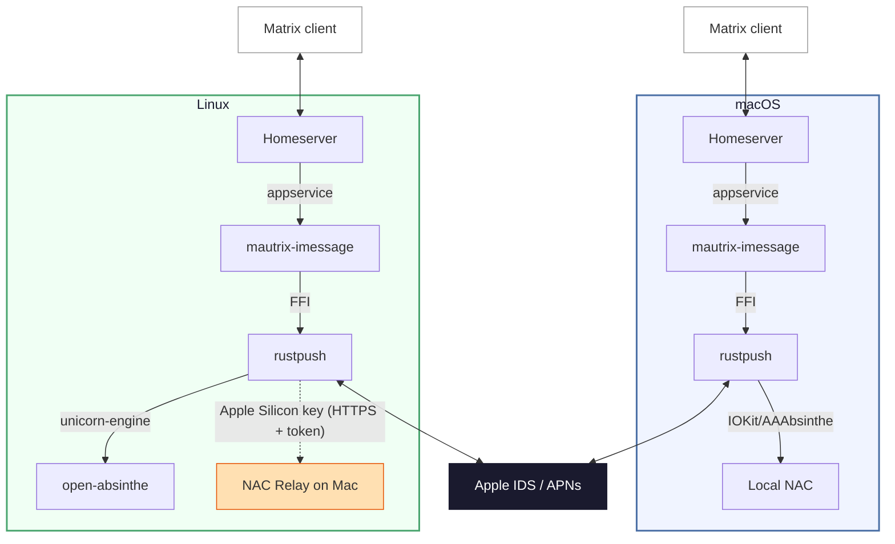

# Corten-Matrix

A Matrix–iMessage puppeting bridge built on [rustpush](https://github.com/OpenBubbles/rustpush) — like its namesake steel, the oxidation is the protective layer. Send and receive iMessages from any Matrix client.

This is the **v2** rewrite using [rustpush](https://github.com/OpenBubbles/rustpush) and [bridgev2](https://mau.fi/blog/megabridge-twilio/) — it connects directly to Apple's iMessage servers without SIP bypass, Barcelona, or relay servers.

**Features**: text, images, video, audio, files, reactions/tapbacks, edits, unsends, typing indicators, read receipts, group chats, SMS forwarding, contact name resolution, **FaceTime calls** (web join links — works from non-Apple platforms), **iOS 18 Focus / Do Not Disturb status** for contacts, **iCloud Shared Albums**, and **Name & Photo Sharing** fallback for unknown senders.

**Platforms**: macOS (full features) and Linux (via hardware key extracted from a Mac once). Please note, Contact Key Verification must be disabled for the bridge to function.

## Quick Start (macOS)

macOS 13+ required (Ventura or later). Sign into iCloud on the Mac running the bridge (Settings → Apple ID) — this lets Apple recognize the device so login works without 2FA prompts.

### With Beeper

```bash
git clone https://github.com/lrhodin/imessage.git
cd imessage
make install-beeper
```

The installer handles everything: Homebrew, dependencies, building, Beeper login, iMessage login, config, and LaunchAgent setup.

### With a Self-Hosted Homeserver

```bash
git clone https://github.com/lrhodin/imessage.git
cd imessage
make install
```

The installer auto-installs Homebrew and dependencies if needed, walks you through homeserver URL / domain / Matrix ID / database choice and a few feature toggles (CloudKit backfill, FaceTime Bridge, StatusKit notifications, external CardDAV, HEIC conversion, video transcoding), generates config files, handles iMessage login, and starts the bridge as a LaunchAgent. It will pause and tell you exactly what to add to your `homeserver.yaml` to register the bridge. You can re-run `make install` any time to flip these toggles without wiping your data — see [Reconfiguring without editing YAML](#reconfiguring-without-editing-yaml).

## Quick Start (Linux)

The bridge runs on Linux using a hardware key extracted once from a real Mac. No Mac needed at runtime for Intel keys; **Apple Silicon Macs** require the NAC relay (a small background process on the Mac).

### Prerequisites

Ubuntu 22.04+ (or equivalent). Only `git`, `make`, and `sudo` are needed — the build installs everything else:

```bash
sudo apt install -y git make
```

### Step 1: Extract hardware key (one-time, on your Mac)

The path depends on your Mac's CPU. **Intel Macs** can hand off the key once and the Mac is no longer involved at runtime. **Apple Silicon Macs** (M1, M2, M3, …) lack the encrypted IOKit properties the x86_64 NAC emulator needs, so they additionally need a small NAC relay running on the Mac whenever the bridge is online.

#### Intel Mac

Pick one extraction option:

**Option A: GUI app (recommended, macOS 10.15+ Catalina)**

Download the pre-built `ExtractKey.app.zip` from the [1.0.0 release](https://github.com/lrhodin/imessage/releases/tag/1.0.0), or build it yourself on any Mac (Intel or Apple Silicon):

```bash
git clone https://github.com/lrhodin/imessage.git
cd imessage/tools/extract-key-app
./build.sh
```

Either way, copy `ExtractKey.app` to the Intel Mac and double-click it. The app reads hardware identifiers, displays them, and lets you copy or save the base64 key. If the Mac is missing encrypted IOKit properties (`_enc` fields), the app offers an **Enrich Key** button to compute them on the spot — no extra steps needed.

> **Gatekeeper**: An app you **build yourself** opens with no prompt — locally-built apps aren't quarantined. A **downloaded** pre-built copy is, though: macOS flags anything downloaded and the app is ad-hoc signed (not notarized — just a fact of macOS), so it's blocked on first launch. To open the downloaded copy:
>
> - **macOS 13+ (Ventura)**: Double-click it, then go to **System Settings → Privacy & Security**, scroll down, and click **Open Anyway**.
> - **macOS 10.15–12**: Right-click (or Control-click) the app and choose **Open** from the context menu, then **Open** in the dialog.
> - **Terminal**: Run `xattr -cr ExtractKey.app` to strip the quarantine flag, then double-click normally.

**Option B: CLI (macOS 13+ with Go)**

```bash
git clone https://github.com/lrhodin/imessage.git
cd imessage
go run tools/extract-key/main.go
```

**Option C: older Macs (macOS 10.13 High Sierra through 12) without Go**

The CLI extractor uses CGO with macOS frameworks (Foundation, IOKit, DiskArbitration), so it has to be compiled on the target Mac itself. A self-contained build script handles that — it has its own `go.mod` pinned to Go 1.20 so it builds on High Sierra:

```bash
# On the older Mac:
git clone https://github.com/lrhodin/imessage.git
cd imessage/tools/extract-key
./build.sh
./extract-key
```

This reads hardware identifiers (serial, MLB, ROM, etc.) and outputs a base64 key. The Mac is not modified and can continue to be used normally.

**Enriching keys from older Macs**

Some older Intel Macs ship a stripped-down IOKit registry that's missing the encrypted hardware identifier fields (the `_enc` properties — five in total, covering serial, MLB, ROM, platform UUID, and root-disk UUID) the x86_64 NAC emulator needs. Extraction still completes, but Apple's IDS layer will later reject validation data computed from a key that lacks them. Enrichment encrypts the plaintext values with the same routine a real Mac uses, producing byte-identical `_enc` bytes.

**On the Mac (GUI app, single button press)**

The Option A app does this for you. If any `_enc` fields came back empty, an **Enrich Key** button appears next to the extracted key. Press it and the app fills in the missing fields and re-renders the now-complete base64 key for you to copy. The Mac running the app must be Intel.

**On the Linux bridge server (CLI, x86_64 only)**

If you extracted with the CLI (Option B / C) and the bridge fails NAC validation pointing at missing `_enc` fields, enrich on the Linux host instead:

```bash
cd rustpush/open-absinthe
cargo run --bin enrich_hw_key -- --file ~/hwkey.b64 > ~/hwkey-enriched.b64
```

Use the enriched output (`~/hwkey-enriched.b64`) for the rest of the install in place of the raw key. x86_64 Linux only.

#### Apple Silicon Mac

Run the NAC relay — a small HTTP server on the Mac that generates Apple validation data using the native `AAAbsintheContext` framework. The relay stays running whenever you want the bridge online; you'll point the bridge at it from the Linux side.

**Option 1: GUI app (recommended)**

Download the pre-built `NACRelay.app.zip` from the [1.0.0 release](https://github.com/lrhodin/imessage/releases/tag/1.0.0), or build the menubar app yourself — it bundles the relay, key extraction, and status monitoring in one place:

```bash
cd tools/nac-relay-app
./build.sh
open NACRelay.app
```

The app appears as an antenna icon in the menubar (no dock icon). It auto-starts the relay on launch, shows the relay address and auth info, and lets you extract the hardware key with relay credentials embedded — all from the popover UI. Click **Extract Hardware Key**, then **Copy Key** to get the base64 key.

> **Gatekeeper**: Same as the extractor app above — a copy you build yourself opens with no prompt, but the **downloaded** pre-built `NACRelay.app` is quarantined (ad-hoc signed, not notarized — a fact of macOS). Open it via **right-click → Open** (macOS 10.15–12), **System Settings → Privacy & Security → Open Anyway** (macOS 13+), or `xattr -cr NACRelay.app` in Terminal.

**Option 2: CLI**

```bash
go build -o ~/bin/nac-relay ./tools/nac-relay/
~/bin/nac-relay --setup
```

This installs a LaunchAgent that starts on login and auto-restarts if it crashes.

The relay auto-generates a self-signed TLS certificate and a random bearer token on first start, stored in `~/Library/Application Support/nac-relay/`. All endpoints (except `/health`) require the token. The bridge verifies the relay's certificate fingerprint (Go side) and authenticates with the token (both Go and Rust sides).

```bash
# Check it's running
tail -f /tmp/nac-relay.log
```

**Extract the key with the relay URL (CLI only — the GUI app does this automatically):**

```bash
go run tools/extract-key/main.go -relay https://<your-mac-ip>:5001/validation-data
```

The `extract-key` tool reads the token and certificate fingerprint from `relay-info.json` (written by the relay) and embeds them in the hardware key automatically. The relay must be running before you run `extract-key`.

If the bridge runs outside your LAN (e.g., cloud VM), forward port 5001 TCP to your Mac's local IP. Lock the allowed source IPs to your bridge server's IP for defense in depth — the relay is also protected by TLS + bearer token auth.

### Step 2: Build and install the bridge (on Linux)

#### With Beeper

```bash
git clone https://github.com/lrhodin/imessage.git
cd imessage
make install-beeper
```

#### With a Self-Hosted Homeserver

```bash
git clone https://github.com/lrhodin/imessage.git
cd imessage
make install
```

On first run expect ~3 minutes for the Rust library to compile.

### Step 3: Login

`make install` / `make install-beeper` detects that no login exists and runs the bridge's `login` subcommand inline at the end of Step 2. You're prompted right there in the terminal for:

1. Your hardware key (paste the base64 from Step 1)
2. Your Apple ID and password
3. The 2FA code sent to your trusted devices

When the script finishes you're already logged in and the bridge is up.

**Alternative: log in through the bridge bot.** If you ever need to log in (or log back in) outside the install script, DM the bridge bot in the Matrix management room and run the **"Apple ID (External Key)"** login flow there — same three prompts, same result.

## Quick Start (Docker, Linux only)

> **Linux only. Don't run the bridge in Docker on macOS** — Docker Desktop on Mac runs the daemon in a slow VM and has flaky bind mounts. Mac users always use `make install` / `make install-beeper`.

The Docker path bundles the same binary (built with `make build` so all rustpush patches apply), runs the existing install scripts inside the container, and stores state on a bind mount you choose — `~/.local/share/mautrix-imessage` by default (matches bare-Linux so migration is trivial), or wherever fits your platform. The image lives at `ghcr.io/lrhodin/imessage` and is built for `linux/amd64` + `linux/arm64`, so it runs on x86_64 boxes as well as ARM hosts. The bridge is driven from the host with a small CLI called `imessage`, which is a thin wrapper around `docker exec` / `docker compose`. Prereqs: Docker Engine 20.10+ and `docker compose` v2 (`docker compose version`, not `docker-compose`) — install via Docker's official docs at <https://get.docker.com> if you don't have it yet. Plus a Beeper account or your own Matrix homeserver, and a hardware key extracted once from a Mac ([Step 1 above](#step-1-extract-hardware-key-one-time-on-your-mac)).

### Install

```bash
# 1. Install the host CLI (drops `imessage` at /usr/local/bin, on PATH by default).
curl -fsSL https://raw.githubusercontent.com/lrhodin/imessage/master/scripts/install-imessage.sh | sudo bash

# 2. Pick a directory you'll keep docker-compose.yml in (~/docker/imessage/, /srv/imessage/, etc.).
#    From inside it, drop in the example compose file:
curl -fsSL https://raw.githubusercontent.com/lrhodin/imessage/master/docker-compose.example.yml -o docker-compose.yml

# 3. Edit it (see "Configuring docker-compose.yml" below).

# 4. Bring it up and run the setup wizard. `imessage start` must be run from the directory
#    containing docker-compose.yml — or set IMESSAGE_COMPOSE_FILE to its absolute path.
imessage start
imessage setup
```

`imessage setup` is the same install script the bare-Linux path uses, running inside the container. For Beeper that's: bbctl login → bbctl config → iMessage login (paste hardware key + Apple ID + password + 2FA). For self-hosted: homeserver URL → domain → Matrix ID → DB choice → iMessage login. Then optional CardDAV, preferred handle, FaceTime/StatusKit/HEIC/video toggles.

When the wizard finishes, the container detects the new `config.yaml` and starts the bridge. `imessage logs` shows it running. Send yourself an iMessage to confirm the round trip.

> **Want to read the installer before running it?** Sensible — `curl | bash` is a trust call. Download and inspect first:
> ```bash
> curl -fsSL https://raw.githubusercontent.com/lrhodin/imessage/master/scripts/install-imessage.sh -o install-imessage.sh
> less install-imessage.sh
> sudo bash install-imessage.sh
> ```

> **Stale curl download?** GitHub's raw CDN can serve cached copies of `master` for ~5 minutes. If you just merged a change upstream and your re-download still hands you the old file, append `?nocache=$(date +%s)` — forces a fresh edge fetch:
> ```bash
> # The installer (Step 1 command, cache-busted):
> curl -fsSL "https://raw.githubusercontent.com/lrhodin/imessage/master/scripts/install-imessage.sh?nocache=$(date +%s)" | bash
>
> # The imessage wrapper directly, skipping install-imessage.sh:
> curl -fsSL "https://raw.githubusercontent.com/lrhodin/imessage/master/scripts/imessage?nocache=$(date +%s)" -o /usr/local/bin/imessage && chmod +x /usr/local/bin/imessage
>
> # The compose example (Step 2 command, cache-busted):
> curl -fsSL "https://raw.githubusercontent.com/lrhodin/imessage/master/docker-compose.example.yml?nocache=$(date +%s)" -o docker-compose.yml
> ```
> Same trick works for any `raw.githubusercontent.com` URL: append `?nocache=$(date +%s)`.

### Configuring `docker-compose.yml`

One required edit, one platform-dependent, one optional:

1. **`BEEPER` env var** *(required)* — `"true"` for Beeper, `"false"` for self-hosted.
2. **The bind mounts under `volumes:`** *(only if you're not on standard Linux)*. Defaults to `${HOME}/.local/share/mautrix-imessage` → `/data` (bridge state — `config.yaml`, DB, session, trustedpeers) and `${HOME}/.config/bbctl` → `/home/bridge/.config/bbctl` (bbctl Beeper auth). The bridge-state path matches bare-Linux's `~/.local/share/mautrix-imessage/`, so migration is no-copy.

   | Platform | Bridge state path | bbctl path |
   |---|---|---|
   | Standard Linux | `~/.local/share/mautrix-imessage` | `~/.config/bbctl` |
   | UNRAID | `/mnt/user/appdata/Rustpush-Matrix/data` | `/mnt/user/appdata/Rustpush-Matrix/bbctl` |
   | Synology | `/volume1/docker/Rustpush-Matrix/data` | `/volume1/docker/Rustpush-Matrix/bbctl` |
   | TrueNAS / ZFS | dataset of your choice | dataset of your choice |

3. **`PUID` / `PGID`** *(optional, defaults `1000:1000`)* — the UID/GID the bridge runs as. Edit if you want the bridge to write as a different user: UNRAID `99:100` (`nobody:users`), TrueNAS Scale `568:568`, root `0:0` (discouraged). Numeric only — names don't translate. You don't need to chown your bind mounts to match; the entrypoint does that on first start.

To look up your own: `id -u` / `id -g`, or `stat -c '%u:%g' <path>` for an existing directory.

### Commands

The `imessage` CLI is a thin wrapper — every subcommand maps to a small `docker` / `docker compose` invocation. Useful when debugging, when teaching someone else, or when you want to do the same thing manually:

| Want to… | Run | Equivalent raw command |
|---|---|---|
| Tail bridge logs | `imessage logs` | When the container is running: `docker exec -it Rustpush-Matrix tail -F /data/logs/bridge.log` (inotify across bind mounts is unreliable, so we tail from inside). When stopped or restart-looping: `tail -F <host bind-mount>/logs/bridge.log` from the host. |
| Check if it's running | `imessage status` | `docker ps --filter name=^Rustpush-Matrix$` |
| Restart the bridge | `imessage restart` | `docker compose restart Rustpush-Matrix` |
| Stop / start it | `imessage stop` / `imessage start` | `docker compose stop Rustpush-Matrix` / `docker compose up -d` (the container's root prelude handles bind-mount perms + host-path symlinks at startup) |
| Pull a new image + restart | `imessage update` | `docker compose pull && docker compose up -d` |
| Re-run iMessage login | `imessage login` | `docker exec -it Rustpush-Matrix as-bridge /entrypoint.sh login` |
| Re-run setup (flip a toggle) | `imessage setup` | `docker exec -it Rustpush-Matrix as-bridge imessage-setup` |
| Debug shell inside | `imessage shell` | `docker exec -it Rustpush-Matrix as-bridge bash` |
| `bbctl` (Beeper bridge-manager) | `imessage bbctl <args>` | `docker exec -it Rustpush-Matrix as-bridge bbctl <args>` |

`as-bridge` is a tiny in-container wrapper that re-applies the entrypoint's setpriv drop to `PUID:PGID` — `docker exec` inherits the container's USER (root, so the entrypoint can chown bind mounts at PID 1), so without `as-bridge` every host-side `imessage bbctl …` would run as root inside the container. When the wrapper invokes `docker compose`, it inserts `-f "$IMESSAGE_COMPOSE_FILE"` if that env var is set, otherwise compose looks in the current directory.

`setup` / `login` / `logs` / `status` / `shell` / `bbctl` work from anywhere (found by container name). Lifecycle commands (`start` / `stop` / `restart` / `pull` / `update`) need to be in the `docker-compose.yml` directory, or set `IMESSAGE_COMPOSE_FILE=~/docker/imessage/docker-compose.yml` in your shell rc to run them from anywhere.

### How the privilege model works

The image's `USER` is unset — PID 1 enters the entrypoint as root. A small root prelude runs, all steps conditional on detection (so subsequent starts are no-ops):

1. **Chowns bind-mount targets to `PUID:PGID`** — only if `find -quit` spots a mismatched file.
2. **Creates a host-path symlink** from the bind mount's host source path inside the container → `/data`. Lets absolute paths from a bare-Linux install (e.g. `uri: file:/root/.local/share/mautrix-imessage/mautrix-imessage.db` baked into `config.yaml`) resolve when running in Docker. Skipped if the symlink already points where it should.
3. **Adds `o+x` to each ancestor of the symlink** so `PUID` can traverse them — `/root` ships at `0700` in the base image, so without this the kernel denies the path walk before SQLite ever opens the file.
4. **`setpriv`s to `PUID:PGID`** and re-execs itself. From there, the bridge runs as the configured non-root user.

Host-side `docker exec` calls (`imessage setup` / `bbctl` / `shell` / `login`) go through `/usr/local/bin/as-bridge` inside the container, which re-applies the same setpriv drop so they don't end up running as root.

### Migrating between bare-Linux and Docker

The bind-mount layout matches the bare-Linux paths, so migration in either direction is a no-copy operation — stop one runtime, start the other against the same files.

**Bare-Linux → Docker:**

```bash
systemctl --user stop mautrix-imessage
systemctl --user disable mautrix-imessage    # optional: don't restart on reboot
```

Then follow the Docker setup above keeping the default bind-mount source. **Skip `imessage setup`** — your existing `config.yaml` is already in place. `imessage start` is enough: the entrypoint chowns the existing files, symlinks the host path to `/data` so the absolute DB URI in `config.yaml` resolves unchanged, and opens traversal on the ancestors. No config edits, no re-login.

**Docker → bare-Linux:**

```bash
imessage stop
docker compose down
git clone https://github.com/lrhodin/imessage.git
cd imessage
make install          # or make install-beeper
```

Run the install **as the user that owns the bind-mount files**. The installer detects the existing `config.yaml` + DB, skips the iMessage login step, writes the systemd unit, and starts the bridge against the same state.

If the bare-Linux user's `$HOME` differs from the one Docker ran under (e.g. Docker as `root` with `${HOME}=/root`, now installing as your own account), the absolute paths in `config.yaml` point at the wrong location. Either:

```bash
# Move the state dir to match the new $HOME:
sudo mv /root/.local/share/mautrix-imessage ~/.local/share/
sudo chown -R $(id -u):$(id -g) ~/.local/share/mautrix-imessage
```

…or rewrite the DB `uri:` lines to relative paths so they resolve against the data dir regardless of host:

```bash
sed -i 's|file:/root/.local/share/mautrix-imessage/|file:|g; s|sqlite:/root/.local/share/mautrix-imessage/|sqlite:|g' \
    ~/.local/share/mautrix-imessage/config.yaml
```

### Apple Silicon NAC relay (Docker)

If your hardware key was extracted from an Apple Silicon Mac, the bridge fetches NAC validation data from a relay running on that Mac (see [Step 1 → Apple Silicon Mac](#apple-silicon-mac)). The relay URL, bearer token, and TLS fingerprint are all embedded in the base64 key — nothing to configure in compose. The Mac needs to be reachable from the Docker host (LAN, VPN, or port-forwarded WAN). Intel keys don't need a relay — the x86_64 unicorn emulator runs entirely in-process inside the container.

### Troubleshooting (Docker)

- **`imessage start` says "Cannot connect to the Docker daemon"** — Docker isn't running, or your user isn't in the `docker` group. Log out and back in after adding yourself.
- **`imessage logs` keeps showing `no /data/config.yaml yet`** — `imessage setup` never finished, or exited mid-flow. Re-run; it's safe.
- **Container restarts in a loop** — `imessage logs` shows the actual error. The entrypoint chowns and symlinks on every start where they're not already right, so persistent permission errors usually mean either (a) the bind mount itself isn't writable by root (read-only fs, immutable bits, SELinux/AppArmor) or (b) the bridge is failing for unrelated reasons.
- **`unable to open database file: permission denied`** — config.yaml URI path doesn't match your bind-mount source. The entrypoint handles the common case (host bind source = path baked into config). You only need to edit `config.yaml` if you copied state from another machine. The fix is to make each `uri:` line relative:
  ```yaml
  uri: file:mautrix-imessage.db
  ```
  The bridge resolves relative paths against its working directory (`/data`). Stop the container, edit, start again — state files don't need to move.
- **Bridge starts but doesn't show up in your homeserver** — `imessage logs` should show the appservice connecting. If it doesn't: on Beeper, re-run `imessage setup`. Self-hosted, confirm the bridge's `as_token`/`hs_token` and namespace from `<bind-mount>/registration.yaml` are loaded by your homeserver and that the homeserver URL in `config.yaml` is reachable from inside the container.
- **Need a shell inside** — `imessage shell` drops you into bash as the bridge user.

## Login

There are two ways to log in:

- **Through the install script (default).** `make install` and `make install-beeper` detect a missing login and run `mautrix-imessage-v2 login` inline at the end of the install. This is the path almost everyone uses — answer the prompts in the terminal and you're done.
- **Through the bridge bot (alternative).** DM the bot in the Matrix management room and run the **"Apple ID (External Key)"** login flow. Useful if you skipped the script's login step, want to switch handles, or are re-logging without re-running install.

Either path follows the same prompts: Apple ID → password → 2FA (if needed) → handle selection. On macOS, if the Mac is signed into iCloud with the same Apple ID, login completes without 2FA.

If your Apple ID has multiple identities registered (e.g. a phone number and an email address), you'll be asked which one to use for outgoing messages. This is what recipients see your messages "from". To change it later, set `preferred_handle` in the config (see [Configuration](#configuration)) or log in again.

### SMS Forwarding

To bridge SMS (green bubble) messages, enable forwarding on your iPhone:

**Settings → Messages → Text Message Forwarding** → toggle on the bridge device.

### Receiving messages

Incoming iMessages automatically create Matrix rooms. History backfill uses **CloudKit** by default — that's the modern, supported path and what almost everyone should pick.

**Local chat.db** (`backfill_source: chatdb`) is a last-resort fallback for older macOS versions that can't run CloudKit backfill at all. If your Mac is in that bucket, the **preferred workaround is to run the bridge on Linux instead** (extract the hardware key once via [Quick Start (Linux)](#quick-start-linux), then let the Linux bridge do CloudKit backfill normally). Only choose `chatdb` if you actually have to run the bridge on a legacy Mac and Linux isn't an option — it's macOS-only and requires **Full Disk Access** (System Settings → Privacy & Security → Full Disk Access → add the bridge binary or Terminal) to read `~/Library/Messages/chat.db`. Without FDA the bridge can't read the file and chat.db backfill silently does nothing.

## Bridge commands

In the **management room** (the bot DM, opened automatically when you log in), type commands bare — no prefix:

```
start-chat
help
logout
```

In **portal rooms** (any bridged DM or group), prefix commands with `!im`:

```
!im facetime
!im help
```

To abort an interactive command (a picker waiting for your reply), type `cancel` in the management room or `!im cancel` in a portal.

### Common commands

| Command | What it does |
|---|---|
| `start-chat` | Open a new iMessage DM. With no arguments, the bot walks you through phone vs. email and explains the country-code format. With an argument (`start-chat +15551234567` or `start-chat someone@icloud.com`) it skips the picker. |
| `contacts` | Search your synced contacts by name (iCloud, external CardDAV, or local macOS Contacts depending on `backfill_source` and `carddav` settings) and reply with a number to open a chat. Different from `start-chat` — use this when you don't remember the number/email. Alias: `find`. |
| `restore-chat` | List iMessage chats in the recycle bin. Reply with a number to bring one back, including its history. |
| `logout` | Sign out of iMessage. Lists active handles, you reply with a number (or `all`). The bot then walks you through the manual step at `appleid.apple.com → Devices` to fully revoke the bridge from Apple's servers. |
| `help` | Full command list, grouped by section. |

### Phone-number format for `start-chat`

Always include the country code with a leading `+`. Spaces, dashes, and parentheses are stripped automatically; you don't need to type `tel:` / `mailto:` prefixes either.

| Country | Format |
|---|---|
| USA / Canada | `+1 555 123 4567` |
| UK | `+44 20 7946 0958` |
| France | `+33 1 23 45 67 89` |
| India | `+91 98765 43210` |

A bare US number (`5551234567`) won't work — the country code is required. Look up codes at <https://countrycode.org>.

### Logging out

`logout` does the bridge-side teardown automatically — disconnects from Apple, removes the login from the bridge, kicks you from portals, and wipes the local session backup so a re-login starts from a clean slate.

The bridge has no API to deregister your IDS identity from Apple, so the success message walks you through the final step:

1. Sign in at <https://appleid.apple.com>.
2. Go to **Devices**.
3. Find the entry for the bridge (often shown as a Mac, sometimes named "Apple Device").
4. Click **Remove from account**.

Until you do step 4, Apple still considers the bridge a registered iMessage device.

## FaceTime

> **Who this is for**: Matrix users on **Android, Windows, and Linux** who don't have an Apple device to take FaceTime calls on. The bridge places and receives FaceTime calls through Apple's web client (which runs in any modern browser on those platforms). If you already own a Mac or iPhone signed into the same Apple ID, the call rings on your Apple device natively and the bridge's web-join wrapper just clutters the chat — see [Opting out](#opting-out) below.

### In a 1:1 portal

```
!im facetime
```

Rings the contact and posts a "🌐 Join FaceTime call" notice in the portal. Tap the link on your Android / Windows / Linux Matrix client to open Apple's FaceTime web client in a browser and join the call. The contact's iPhone or Mac shows it as a normal incoming FaceTime, and they can answer wherever they like.

When a contact rings **you**, the bridge posts "📞 **Incoming FaceTime call from {name}.**" in the DM portal with an **Answer FaceTime call** link that opens the FaceTime web client in your browser. Missed calls show up as a notice with a **Call back {name}** button (taps re-ring the contact through the bridge); "answered on another device" surfaces as a one-line passive notice. The bridge keeps a persistent ghost in the room used for FaceTime signalling — that's expected, leave it in place.

### Other commands

| Command | What it does |
|---------|-------------|
| `facetime-send` | Generate a link and deliver it as an iMessage to the contact (no Matrix message). |
| `facetime-clear` | Revoke every bridge-created FaceTime link so the next `facetime` mints a fresh one. |
| `facetime-invalidate-peer` | Force the peer's device to drop its cached bridge identity. Use when calls intermittently come through as audio-only. |
| `facetime-rotate-identity` | Re-register the bridge's IDS identity (heavier than the per-peer invalidate). |
| `facetime-letmein` / `facetime-letmein-approve` / `facetime-letmein-deny` | List, approve, or deny pending Let-Me-In delegated-access requests. |

A full list lives under `!im help` in the **FaceTime** section.

### Display name on join links

The name pre-filled on the FaceTime web join page comes from your Apple Account. To override it, set `facetime_display_name` in `~/.local/share/mautrix-imessage/config.yaml`.

### Caller identity on the recipient's screen (the `temp:` UUID)

When you place a call, the person you're calling sees **your name** — but you may also notice a `temp:<uuid>` identity shown alongside it (most visibly in the call-detail card or call history). This is expected. Here's the reasoning:

A bridge FaceTime call is carried by **Apple's FaceTime web client running in your browser**, not by the bridge process itself. When your browser opens the join link, Apple's web client generates a throwaway pseudonym for that session — a `temp:<uuid>` handle — and that pseudonym *is* the browser participant's identity on the call. The bridge never creates it and has no way to rename it.

To make your name appear, the bridge stamps your display name (`facetime_display_name` → Apple Account name → your handle) onto that participant's **nickname** on the wire, so FaceTime renders your name on top. But FaceTime also shows a participant's underlying *identity* beneath the nickname, and for the web client that identity is the `temp:<uuid>`. So you'll typically see your name **twice** — once for your real IDS handle, once for the browser participant — plus that lingering pseudonym line under the latter.

Removing the `temp:<uuid>` entirely would mean replacing or pruning the browser participant from the call — but that participant is the one actually carrying your audio and video, so removing it **drops the call**. (OpenBubbles' native Android app sidesteps this by injecting the name directly into its own embedded webview; a browser-based Matrix link can't reach into Apple's page to do that.) The bridge therefore leaves the pseudonym in place: showing your name is the safe, meaningful improvement, and suppressing the last identity line isn't possible without breaking calling.

### Opting out

If you have a Mac or iPhone signed into the same Apple ID, FaceTime rings there natively — the bridge's web-join wrapper adds nothing, so you should disable it. The `make install` / `make install-beeper` scripts ask "Disable FaceTime Bridge?" both on first install and on every subsequent re-run, so you can flip this at any time without editing YAML by hand. (You can also set `disable_facetime: true` in `~/.local/share/mautrix-imessage/config.yaml` directly.) Disabling skips every `facetime-*` command and suppresses all inbound FaceTime notices in your Matrix portals.

## Focus & Do Not Disturb

When a contact toggles a Focus mode (Do Not Disturb, Sleep, Work, etc.) on iOS 18+, the bridge marks it on the **chat title** — appending a 🌙 to the contact's name (e.g. "Alice 🌙") while their Focus/DND is on, and removing it when they turn it off:

- The 🌙 rides on the DM's name (a room-state change, updated in place), not a posted message — so it never bumps or unarchives the chat, and there's no timeline spam.
- The contact's Matrix ghost also gets a presence update, so clients that render presence reflect the same state.
- DM-only: a group has a single shared title, so per-member Focus can't ride on it.
- Focus is a global on/off and not per contact.

This is the closest analog to the moon Apple shows next to a name. The bridge announces itself as "available" once after startup so peer iPhones reciprocate with the key material needed to decrypt their subsequent presence updates — leave `statuskit_share_on_startup: true` for the best chance of seeing contacts' Focus state.

If you'd rather not see the indicator (or you already track Focus on another Apple device), the install scripts ask "Enable StatusKit notifications?" on first install and on every subsequent re-run, so you can flip it at any time. (Or set `statuskit_notifications: false` in `~/.local/share/mautrix-imessage/config.yaml`.) Disabling suppresses the 🌙 indicator and presence updates while keeping the underlying StatusKit registration intact.

## Shared Albums

iCloud Shared Albums (Photo Streams) you subscribe to surface as dedicated rooms with the album's photos and videos backfilled. Use:

| Command | What it does |
|---------|-------------|
| `shared-albums` | Browse available Shared Albums; pick one, then pick assets to download. |
| `shared-subscribe <album-id>` | Subscribe to a Shared Album by ID so the bridge watches it for new assets. |
| `shared-subscribe-token <token>` | Subscribe via the one-time invitation token from an iCloud share URL (`icloud.com/sharedalbum/...`). |
| `shared-unsubscribe <album-id>` | Unsubscribe from an album so the bridge stops watching it. |
| `shared-state` | Dump current Shared Streams state as JSON (debugging). |

A full list lives under `!im help` in the **Shared Streams** section.

## Image and video conversion

The bridge converts a handful of formats automatically so attachments render in Matrix clients and reach iMessage in formats Apple's clients accept. Two behaviours are gated on opt-in toggles; the rest run unconditionally.

### Always on, both directions

- **TIFF ↔ JPEG.** TIFF is re-encoded to JPEG at quality 95 in either direction.
- **Opus voice notes.** iMessage uses Opus in Apple's CAF container; Matrix clients use Opus in an OGG container. The bridge remuxes between the two (no re-encoding — same codec, different wrapper) in either direction.

### Always on, outgoing only

- **Other non-JPEG images → JPEG** at quality 95. PNG and similar formats sent from Matrix are re-encoded before being handed to iMessage; the Matrix event is also edited in place so other Matrix clients see the corrected file. Incoming PNG passes through unchanged.

### Opt-in, incoming only

- **HEIC / HEIF → JPEG** — gated on `heic_conversion` (default off). Decoded with `libheif`, re-encoded at `heic_jpeg_quality` (default `95`, clamped to 1–100). EXIF, ICC color profile, and XMP are preserved; orientation is normalised because `libheif` applies the rotation during decode. Animated / multi-image HEICs collapse to the primary frame with a warning. With the toggle off, HEIC bytes pass through to Matrix — modern clients (Element, Beeper) render them, older clients may not.
- **Non-MP4 video → MP4** — gated on `video_transcoding` (default off). Applies to any `video/*` MIME that isn't already `video/mp4` (`.mov`, `.m4v`, MKV, AVI, WebM, …). The bridge tries a stream-copy remux first (`ffmpeg -c copy -movflags +faststart`) — fast and lossless. If that fails, it falls back to a full re-encode (H.264 `-preset fast -crf 23` plus AAC). Audio tracks are preserved in both modes. The Matrix event ends up as `.mp4` / `video/mp4`.

### Live Photos

iMessage Live Photos arrive as a HEIC still + MOV pair. The still goes through HEIC conversion if `heic_conversion` is on; the MOV goes through video transcoding if `video_transcoding` is on. Both pieces are delivered to Matrix as adjacent messages.

### Size limit

Attachments larger than `max_attachment_size_mb` (default `100`) are **skipped entirely** — never downloaded, transcoded, or uploaded. The default matches Beeper's upload cap: the homeserver rejects anything bigger, so bridging it would only waste a download (the bytes buffer in memory while fetching), a doomed transcode, and disk — all for a guaranteed rejection, and a multi-GB attachment can exhaust RAM on a small host. CloudKit occasionally surfaces very large attachments (multi-GB videos); skipping them up front keeps a backfill from stalling on files that could never land anyway. Self-hosters whose homeserver accepts larger uploads can raise the cap — see [`max_attachment_size_mb`](#key-options), including the note about needing the RAM for it.

### Dependencies

- **`libheif`** is a build dependency. `make build` installs it via Homebrew (macOS) or `apt`/`dnf`/`pacman`/`zypper`/`apk` (Linux) before compiling, regardless of whether `heic_conversion` is enabled.
- **`ffmpeg`** is required at runtime only when `video_transcoding` is enabled. The install scripts install it via the same package manager when you turn the toggle on during the interactive prompts.

## How It Works

The bridge connects directly to Apple's iMessage servers using [rustpush](https://github.com/OpenBubbles/rustpush) with local NAC validation (no SIP bypass, no relay server). When `backfill_source: chatdb` is set on macOS, it additionally reads `~/Library/Messages/chat.db` for backfill and uses the local Contacts framework for name resolution; the default CloudKit path uses iCloud for both.

On Linux, NAC validation uses one of two paths:

- **Intel key**: [open-absinthe](rustpush/open-absinthe/) emulates Apple's `IMDAppleServices` x86_64 binary via unicorn-engine, hooking IOKit/CoreFoundation calls and feeding them hardware data from the extracted key
- **Apple Silicon key + relay**: The bridge fetches validation data from a NAC relay running on the Mac, which calls Apple's native `AAAbsintheContext` framework



### Real-time and backfill

**Real-time messages** flow through Apple's push notification service (APNs) via rustpush and appear in Matrix immediately.

**CloudKit backfill** (optional, off by default) syncs your iMessage history from iCloud on first login. Enable it during `make install` or by setting `cloudkit_backfill: true` in config. When enabled, the login flow will ask for your device PIN to join the iCloud Keychain trust circle, which grants access to Messages in iCloud.

On the **first** install (before the bridge database exists), the install script asks whether you want to cap messages per chat:

- Answer **no** and every available message is backfilled.
- Answer **yes** and pick a per-chat limit (minimum 100).

The cap can't be changed on later re-runs once the database is in place — edit `~/.local/share/mautrix-imessage/config.yaml` directly to change it.

## Privacy

The bridge's design goal is the same as every other bridgev2 bridge: **message content lives in Matrix, and the bridge's own database holds only the routing metadata needed to correlate messages, edits, reactions, and deletes.** The bridgev2 `message` table never had a body column to begin with — it stores IDs, timestamps, and sender references, nothing else.

The one place this bridge has to deviate is **CloudKit backfill**. To turn your iCloud message history into Matrix events, the sync pipeline stages pulled messages — with their plaintext bodies — in a local `cloud_message` cache. That cache is the only spot where message bodies touch disk, and the privacy layer exists to clean it back down to metadata after delivery. (The `chatdb` backfill source never stores bodies at all — it reads `~/Library/Messages/chat.db` live at query time. If you don't enable CloudKit backfill, none of the below applies; no bodies are ever cached.)

### How scrubbing works

A periodic scrubber (every 5 minutes) NULLs the plaintext columns — `text`, `subject`, `sender`, `tapback_emoji` — on `cloud_message` rows, gated by two conditions:

- **Already delivered to Matrix.** A row is only scrubbed once its GUID has a corresponding row in bridgev2's `message` table (i.e. the message reached Matrix), *or* it was deleted/unsent. A message that hasn't bridged yet is never scrubbed — bridging always comes first, so the scrubber can never blank a message out from under the backfill pipeline.
- **Past a 5-minute grace window.** Freshly-ingested rows get a buffer (keyed on last-ingest time) so the backfill pipeline has time to read the body before scrubbing clears it.

Scrubbing the local cache is not data loss: the canonical copy of every message stays in Messages in iCloud on Apple's servers. The `cloud_message` table is only a staging cache for backfill, never the source of truth.

On SQLite, the bridge also sets `_secure_delete=on` for every pooled connection, so the freed pages holding the old plaintext are zeroed rather than left readable on disk. This is SQLite-only; on Postgres the columns are NULLed identically, but scrubbed bytes sit in dead tuples until a routine `VACUUM` reclaims them (the bridge does not run `VACUUM FULL` automatically).

Message **deletes and unsends** scrub the cached body right away — not waiting for the periodic tick — and are fail-closed. For inbound (Apple-side) deletes and unsends, a scrub failure makes the bridge skip emitting the Matrix removal, so the row stays scrub-eligible rather than leaking plaintext. For outbound (Matrix-initiated) redactions, the scrub failure is reported back to the framework so it won't drop its own message row before the body is cleared. The row itself is kept (soft-deleted, body NULLed) for echo detection — it isn't removed from the cache.

### Logs

In the bridge's own connector code, raw iMessage handles (phone numbers, email addresses) and full URLs are not written to logs: handles are replaced with a stable, non-reversible token (SHA-256 → UUID form) so you can still correlate one person across log lines without recording the PII, and URLs are reduced to scheme+host. This is anonymization at the log-write boundary — the values used for routing, handle matching, and StatusKit alias resolution are always the real ones, so functionality is unaffected.

**Caveat:** this covers log lines emitted by this connector (`pkg/connector`). The underlying bridgev2 framework emits its own logs and can still print raw handles/identifiers in its messages — those are outside the connector's control. So "anonymized logs" means the connector's own output, not a guarantee across every line in the file.

### What is *not* scrubbed (by design)

- **Attachment metadata** (`attachments_json`) — filenames, MIME types, sizes, and CloudKit record-names. The record-name is required to re-pull a file from Apple if a Matrix upload fails after bridging. The attachment *bytes* live in CloudKit, not the DB.
- **Chat metadata** (`cloud_chat`) — group display names and participant handles, kept so a conversation's identity (name, members) survives across re-syncs without a refetch.

### Debugging

Everything above is on by default and has no config toggle. The single escape hatch is `debug_disable_privacy` (see [Key options](#key-options)) — a development-only switch that turns off log anonymization and the scrubber and re-fills previously-scrubbed plaintext on the next sync. Leave it `false` in any real deployment.

## Management

### Shell shortcuts

At the end of every install run, the installer offers to drop four aliases into your `~/.zshrc` or `~/.bashrc` so you don't have to memorize the platform-specific `launchctl` / `systemctl` incantations:

| Alias | What it does |
|---|---|
| `start-imessage` | Start the bridge |
| `stop-imessage` | Stop the bridge |
| `restart-imessage` | Restart the bridge |
| `imessage-log` | Tail the live bridge log |

The prompt defaults to **no** — answer `y` to install. The aliases are wrapped in a marker comment block (`# >>> mautrix-imessage shortcuts (managed) >>>` … `# <<< mautrix-imessage shortcuts (managed) <<<`), so re-running an installer and answering `y` replaces (rather than duplicates) the entries. If you skipped them on first install, just re-run and say `y`. To remove them later, delete the marker block from your `~/.zshrc` or `~/.bashrc` by hand — the installer doesn't have an "uninstall aliases" path. Bash and Zsh are auto-detected from `$SHELL`; other shells get a clean skip message. After install, open a new terminal — or `source ~/.zshrc` (or `~/.bashrc`) in your current one — to pick the aliases up.

**Adding them by hand.** The installer auto-detects your shell and the systemd scope, which can misfire in containers — e.g. an LXC / Proxmox guest entered via `pct enter`, where `$SHELL` is unset and there's no per-user systemd session. If the prompt skips you, or the installed aliases don't control the service, paste the lines into your `~/.bashrc` or `~/.zshrc` yourself. Use the `--user` form for a user service, or the `sudo` form when the bridge runs as a **system** service (the usual case in an LXC container, or any install done as root):

```bash
# User service (systemctl --user) — typical desktop / VM install
alias start-imessage='systemctl --user start mautrix-imessage'
alias stop-imessage='systemctl --user stop mautrix-imessage'
alias restart-imessage='systemctl --user restart mautrix-imessage'
alias imessage-log='journalctl --user -u mautrix-imessage -f'

# System service — LXC container or root install
alias start-imessage='sudo systemctl start mautrix-imessage'
alias stop-imessage='sudo systemctl stop mautrix-imessage'
alias restart-imessage='sudo systemctl restart mautrix-imessage'
alias imessage-log='sudo journalctl -u mautrix-imessage -f'
```

Pick one block (not both). Re-`source` the file or open a new terminal to pick the aliases up.

The raw equivalents (and other knobs) are below if you'd rather wire your own thing.

### macOS

```bash
# View logs
tail -f ~/.local/share/mautrix-imessage/bridge.stdout.log

# Restart (auto-restarts via KeepAlive)
launchctl kickstart -k gui/$(id -u)/com.lrhodin.mautrix-imessage

# Stop until next login
launchctl bootout gui/$(id -u)/com.lrhodin.mautrix-imessage

# Uninstall
make uninstall
```

### Linux

```bash
# If using systemd (from make install / make install-beeper)
systemctl --user status mautrix-imessage
journalctl --user -u mautrix-imessage -f
systemctl --user restart mautrix-imessage

# If running directly (debugging or non-systemd hosts)
./mautrix-imessage-v2 -c ~/.local/share/mautrix-imessage/config.yaml
```

### NAC Relay (macOS)

These commands apply to the **CLI install** (LaunchAgent at `com.imessage.nac-relay`). The GUI menubar app manages itself — launch/quit it via the menubar antenna icon, and use the popover for status. The GUI app does not write `/tmp/nac-relay.log`.

```bash
# View logs (CLI install only)
tail -f /tmp/nac-relay.log

# Restart
launchctl kickstart -k gui/$(id -u)/com.imessage.nac-relay

# Stop
launchctl bootout gui/$(id -u)/com.imessage.nac-relay
```

## Configuration

Config lives in `~/.local/share/mautrix-imessage/config.yaml` (generated during install). The default path is set by the Makefile's `DATA_DIR` variable; override it on the command line if you want a different location (e.g. `make install DATA_DIR=/srv/imessage`).

### Reconfiguring without editing YAML

The install scripts (`make install` and `make install-beeper`) are idempotent — re-run them any time and they detect the existing config, then walk you through interactive prompts to flip individual settings. Nothing is wiped. You can use a re-run to change:

- **Preferred handle** — pick a different `tel:` / `mailto:` from the registered list
- **External CardDAV** — change email / server / app password
- **CloudKit backfill** — enable or disable, switch between CloudKit and `chat.db` sources
- **FaceTime Bridge** — enable or disable (`disable_facetime`)
- **StatusKit notifications** — enable or disable the iOS 18 Focus / DND 🌙 chat-title indicator (`statuskit_notifications`)
- **HEIC conversion / video transcoding** — toggle on or off
- **Shell shortcuts** — add the `start-imessage` / `stop-imessage` / `restart-imessage` / `imessage-log` aliases on the next re-run if you skipped them initially (see [Shell shortcuts](#shell-shortcuts))

```bash
make install              # self-hosted homeserver
make install-beeper       # Beeper
```

The per-chat backfill cap (`backfill.max_initial_messages`) is asked only on the **first** install, before the bridge database exists. To change it later, edit `~/.local/share/mautrix-imessage/config.yaml` directly.

> **Warning:** the next snippet deletes your bridge state. Only run it if you mean to start over.

To start completely from scratch (new homeserver, new login, blank database), tear down both LaunchAgents and the on-disk state, then re-run:

```bash
# Bridge
launchctl bootout gui/$(id -u)/com.lrhodin.mautrix-imessage 2>/dev/null
rm -f ~/Library/LaunchAgents/com.lrhodin.mautrix-imessage.plist
rm -rf ~/.local/share/mautrix-imessage

# NAC relay (Apple Silicon Mac users only)
launchctl bootout gui/$(id -u)/com.imessage.nac-relay 2>/dev/null
rm -f ~/Library/LaunchAgents/com.imessage.nac-relay.plist
rm -rf ~/Library/Application\ Support/nac-relay ~/Applications/nac-relay.app

make install
```

### Key options

Most knobs live at the top level of the network connector config. Defaults shown match `pkg/imconfig/example-config.yaml`.

| Field | Default | What it does |
|-------|---------|-------------|
| `cloudkit_backfill` | `false` | Master switch for message history backfill. Requires device PIN during login to join the iCloud Keychain. |
| `backfill_source` | `cloudkit` | `cloudkit` (default) or `chatdb` (legacy macOS fallback only — macOS-only, requires Full Disk Access). For legacy Macs prefer running the bridge on Linux with CloudKit instead. Only relevant when `cloudkit_backfill` is true. |
| `url_previews_in_backfill` | `true` | Fetch link previews (og:/twitter: tags + thumbnail) for URL-bearing messages during backfill. Each URL costs up to three HTTP round-trips inline with conversion — set `false` to skip previews during backfill only (live inbound messages and outbound edits still build them). |
| `displayname_template` | *(see [example-config.yaml](pkg/imconfig/example-config.yaml))* | Go template controlling how iMessage contacts appear in Matrix. Falls through `FirstName → LastName → Nickname → Phone → Email → ID`. Variables: `{{.FirstName}}`, `{{.LastName}}`, `{{.Nickname}}`, `{{.Phone}}`, `{{.Email}}`, `{{.ID}}`. |
| `preferred_handle` | *(from login)* | Outgoing iMessage identity in URI form (`tel:+15551234567` or `mailto:user@example.com`). |
| `disable_facetime` | `false` | Skip every `facetime-*` command and suppress inbound FaceTime notices. Set true if you have a Mac/iPhone that handles FT natively. |
| `facetime_display_name` | *(from Apple Account SPD)* | Override the name pre-filled on FaceTime web join links. Falls back to the bare iMessage handle if the SPD lookup is also blank. |
| `statuskit_share_on_startup` | `true` | Publish "available" once after startup so peer iPhones reciprocate with the key material needed to decrypt their Focus/DND state. |
| `statuskit_notifications` | `true` | Append a 🌙 to a contact's chat title (+ ghost presence) when they toggle iOS 18 Focus / DND. The underlying StatusKit registration runs either way. |
| `video_transcoding` | `false` | Auto-remux non-MP4 videos (e.g. QuickTime `.mov`) to MP4 for broad Matrix client compatibility. Requires `ffmpeg`. |
| `heic_conversion` | `false` | Auto-convert HEIC/HEIF images to JPEG. Requires `libheif`. |
| `heic_jpeg_quality` | `95` | JPEG output quality (1–100) when HEIC conversion is enabled. |
| `max_attachment_size_mb` | `100` | Skip attachments larger than this many MB — they're never downloaded, transcoded, or uploaded. The default matches Beeper's upload limit; the homeserver rejects anything larger, so bridging it just wastes bandwidth, CPU, and memory for a guaranteed rejection (and a multi-GB attachment can exhaust RAM on a small host, since attachments buffer in memory while downloading). Raise it **only** if your homeserver accepts bigger uploads — e.g. a self-hosted Synapse with a higher `max_upload_size` — **and** the host has the RAM to spare. On Beeper, raising it has no effect: the homeserver still rejects anything over 100 MB. |
| `carddav.email` / `carddav.url` / `carddav.username` / `carddav.password_encrypted` | *(unset)* | External CardDAV server for contact name resolution (Google with app passwords, Nextcloud, Radicale, Fastmail, etc.). Set up via the install script's CardDAV prompt. When configured, used instead of iCloud contacts. |
| `backfill.max_initial_messages` | `2147483647` | Cap on messages per chat for the initial backfill (`2147483647` = uncapped). The install script writes this when CloudKit backfill is enabled — uncapped by default, or the per-chat limit (≥100) you pick on first install. |
| `encryption.allow` | `false` | bridgev2 framework option. Set `true` to enable end-to-bridge encryption. |
| `database.type` | `postgres` | bridgev2 framework option. `postgres` or `sqlite3-fk-wal`; the install script asks during first run and defaults to `postgres`. |
| `debug_disable_privacy` | `false` | **Development only — leave `false` in any real deployment.** Turns off log anonymization and the message-body scrubber, and re-fills previously-scrubbed plaintext on the next CloudKit sync. See [Privacy](#privacy). Does not undo deletes/unsends and does not re-deliver anything to Matrix. |

## Development

```bash
make build      # Build .app bundle (macOS) or binary (Linux)
make rust       # Build Rust library only
make bindings   # Regenerate Go FFI bindings (needs uniffi-bindgen-go)
make clean      # Remove build artifacts
```

### Source layout

```
cmd/
  ├── mautrix-imessage/                     # Bridge entrypoint
  │     ├── main.go                         #   process bootstrap, config load, command registration
  │     ├── login_cli.go                    #   interactive iMessage CLI login (stdin → bridgev2 LoginProcess)
  │     ├── carddav_setup.go                #   install-script helper — CardDAV URL discovery + password encryption
  │     ├── setup_darwin.go                 #   macOS chat.db permission dialogs
  │     └── setup_other.go                  #   non-Darwin stubs (no-ops)
  └── bbctl/                                # Beeper bridge-manager CLI — companion tool that talks to Beeper's
        │                                   # API to register / auth / stop / delete this bridge in Beeper infra.
        │                                   # Built into a separate `bbctl` binary alongside the bridge.
        ├── main.go                         #   CLI entrypoint — sets up the app and dispatches subcommands
        ├── register.go                     #   `register` — provisions a new Beeper bridge + writes default config
        ├── auth.go                         #   `auth` — logs into the Beeper API and persists credentials
        ├── stop.go                         #   `stop` — marks the bridge offline before teardown
        └── delete.go                       #   `delete` — removes the bridge from the Beeper cluster

pkg/connector/                              # bridgev2 connector — the main Go bridge package
  ├── connector.go                          #   bridge lifecycle + platform detection
  ├── client.go                             #   send/receive/reactions/edits/typing
  ├── login.go                              #   Apple ID + external-key login flows
  ├── commands.go                           #   `start-chat`, `logout`, `restore-chat`, `msg-debug`, …
  ├── command_contacts.go                   #   `contacts` command — search + iMessage validation
  ├── facetime.go                           #   FaceTime web-join + call control
  ├── statuskit_commands.go                 #   StatusKit (Focus / DND) commands
  ├── statuskit_cloudkit.go                 #   StatusKit CloudKit pull — fetches + injects peer presence records (bridge-side orchestration of the Rust FFI)
  ├── statuskit_alias_resolver.go           #   StatusKit alias-cluster resolver — maps a presence `from` alias (e.g. an unregistered mailto:) to the right portal via persisted channel↔alias clustering
  ├── sharedstreams.go                      #   iCloud Shared Albums commands + sync
  ├── shared_profile.go                     #   Name & Photo Sharing fallback
  ├── external_carddav.go                   #   external CardDAV contact resolution
  ├── carddav_crypto.go                     #   app-password encryption for carddav config
  ├── cloud_contacts.go                     #   iCloud CardDAV contact sync (DSID + mmeAuthToken)
  ├── contacts_local_darwin.go              #   macOS Contacts framework lookups
  ├── contacts_local_other.go               #   non-Darwin stub
  ├── contact_merge.go                      #   dedupes portals across multiple handles per contact
  ├── chatdb.go                             #   chat.db backfill + contacts (macOS)
  ├── chatdb_darwin.go                      #   macOS-only chat.db platform registration
  ├── permissions_darwin.go                 #   macOS Full Disk Access checks/prompts
  ├── permissions_other.go                  #   non-Darwin stub
  ├── bridgeadapter.go                      #   adapter to the legacy `imessage.Bridge` interface
  ├── identity_store.go                     #   persists APSState / IDSUsers / IDSIdentity
  ├── group_identity.go                     #   detects group portal IDs from sender + participants
  ├── ids.go                                #   identifier ↔ portal ID conversion
  ├── dbmeta.go                             #   portal/ghost/message/login metadata types
  ├── sync_controller.go                    #   APNs-driven real-time event dispatch
  ├── ford_cache.go                         #   Ford key cache (cross-batch MMCS dedup)
  ├── attachment_retrier.go                 #   layer-2 MMCS retry — re-downloads failed attachments
  ├── pending_attachment_store.go           #   DB-backed queue of attachments awaiting retry
  ├── cloud_backfill_store.go               #   CloudKit backfill message store + paging
  ├── recycle_bin_hints.go                  #   recoverable-message metadata for CloudKit recycle bin
  ├── heic.go                               #   HEIC → JPEG conversion (libheif)
  ├── audioconvert.go                       #   audio remux to M4A / CAF
  ├── urlpreview.go                         #   OpenGraph / Twitter Card URL-preview extractor
  ├── util.go                               #   phone normalization + group-key helpers
  ├── capabilities.go                       #   advertised feature set
  ├── config.go                             #   bridge config schema (YAML + `upgradeConfig` helper)
  ├── example-config.yaml                   #   default config template
  └── *_test.go                             #   unit tests (audioconvert, capabilities, carddav_crypto,
                                            #   cloud_backfill_store, config, config_upgrade, dbmeta,
                                            #   external_carddav, ford_cache, ids, util)

pkg/rustpushgo/                             # Rust FFI wrapper (uniffi → cgo)
  ├── src/lib.rs                            #   FFI surface — login / send / receive / CloudKit / Ford
  ├── src/anisette.rs                       #   Linux remote-anisette-v3 wrapper (panic/timeout guards)
  ├── src/local_config.rs                   #   macOS LocalMacOSConfig (IOKit → MacOSConfig + native NAC)
  ├── src/statuskitgo.rs                    #   StatusKit invite-to-channel wrapper
  ├── src/util.rs                           #   plist serde helpers
  ├── src/test_hwinfo.rs                    #   hardware-info FFI smoke test
  ├── src/hardware_info.{h,m}               #   Objective-C IOKit hardware reader (macOS)
  ├── rustpushgo.go                         #   uniffi-generated Go bindings (post-`patch_bindings.sh`)
  ├── rustpushgo.{c,h}                      #   C shim consumed by the Go bindings
  ├── Cargo.toml                            #   crate manifest + feature flags (hardware-key, avid-download)
  └── build.rs                              #   uniffi codegen + Objective-C cc shim build

rustpush/
  ├── open-absinthe/                        # NAC emulator overlay (overlaid on upstream during build)
  │     ├── src/lib.rs                      #   error types + RelayOSConfig setup
  │     ├── src/nac.rs                      #   x86_64 XNU emulator (unicorn-engine) + ARM relay path
  │     ├── src/asm/encrypt.s               #   XNU kernel encrypt routine for IOKit property fields
  │     └── src/bin/enrich_hw_key.rs        #   CLI to fill missing `_enc` fields on Intel hardware keys
  └── certs/                                # Apple cert bundles consumed by upstream rustpush at runtime

third_party/
  ├── rustpush-upstream.sha                 # pinned OpenBubbles/rustpush SHA — Makefile clones + overlays open-absinthe
  └── rustpush-upstream/                    # checked-out clone (git-ignored — Makefile materializes it)

nac-validation/                             # Local NAC via AppleAccount.framework (macOS-only)
  ├── src/lib.rs                            #   Rust wrapper exposing `generate_nac_data` over Obj-C
  ├── src/validation_data.{h,m}             #   AAAbsintheContext bindings
  └── Cargo.toml + build.rs                 #   crate manifest + cc shim build

imessage/                                   # chat.db reader — used by macOS backfill + contacts
  ├── interface.go                          #   Bridge / API interfaces consumed by the connector
  ├── struct.go                             #   message / chat / attachment data types
  ├── tapback.go                            #   tapback (reaction) parsing
  └── mac/                                  # macOS-only chat.db backend
        ├── database.go                     #   opens chat.db, watches for new messages
        ├── messages.go                     #   message-stream queries with filtering
        ├── groups.go                       #   group-chat membership queries
        ├── contacts.go                     #   Contacts framework lookups (display name, etc.)
        ├── attributedstring.go             #   NSAttributedString blob → styled text
        ├── send.go                         #   AppleScript send fallback (legacy macOS path)
        ├── sleepdetect.go                  #   IOKit sleep/wake notifications
        ├── debug.go                        #   record-dump helpers for debugging
        ├── meowMemory.{h,m}                #   shared memory helpers for the Obj-C shims
        ├── meowAttributedString.{h,m}      #   NSAttributedString decoder shim
        ├── meowContacts.{h,m}              #   Contacts framework shim
        └── meowSleep.{h,m}                 #   sleep/wake shim

ipc/
  └── ipc.go                                # JSON-RPC over Unix socket — legacy bridge ↔ client transport

tools/
  ├── extract-key/                          # Hardware-key extractor CLI (Intel Macs, Go)
  │     ├── main.go                         #   reads IOKit identifiers, prints base64 hardware key
  │     └── build.sh                        #   bootstraps Go locally if needed and builds
  ├── extract-key-app/                      # Hardware-key extractor GUI (Intel Macs, SwiftUI)
  │     ├── Package.swift                   #   SwiftPM manifest
  │     ├── build.sh                        #   builds and packages the .app bundle
  │     └── Sources/
  │           ├── ExtractKeyApp/            # Swift UI sources
  │           │     ├── ExtractKeyApp.swift       #   SwiftUI app entrypoint
  │           │     ├── ContentView.swift         #   main UI: extraction + enrichment
  │           │     ├── HardwareExtractor.swift   #   IOKit identifier extraction
  │           │     ├── Enrichment.swift          #   computes `_enc` fields via XNU encrypt
  │           │     ├── IOKitHelpers.swift        #   IOKit property readers
  │           │     ├── SystemInfo.swift          #   MAC / serial / board-id queries
  │           │     ├── Models.swift              #   ExtractionResult types
  │           │     └── Compat.swift              #   macOS 10.15 SF-Symbols fallback
  │           └── CEncrypt/shim.c           #   placeholder; real impl shipped in libxnu_encrypt.a (encrypt.s)
  ├── nac-relay/                            # NAC validation relay CLI (Apple Silicon Macs, Go)
  │     ├── main.go                         #   HTTPS server with bearer-token auth → /validation-data
  │     └── auth.go                         #   self-signed TLS + relay-info.json persistence
  └── nac-relay-app/                        # NAC relay menubar app (Apple Silicon Macs, SwiftUI)
        ├── Package.swift                   #   SwiftPM manifest
        ├── build.sh                        #   builds and packages the .app bundle
        └── Sources/NACRelayApp/
              ├── AppDelegate.swift               #   launches bundled `nac-relay`; menubar lifecycle
              ├── PopoverView.swift               #   status / address / log popover
              ├── RelayManager.swift              #   nac-relay process supervisor + relay-info.json
              ├── KeyExtractor.swift              #   hardware-key extraction with relay URL/token embed
              ├── IOKitHelpers.swift              #   IOKit property readers
              ├── LoginItemManager.swift          #   Start-at-Login toggle (SMAppService)
              ├── SystemInfo.swift                #   MAC / serial / board-id queries
              └── Models.swift                    #   ExtractionResult + RelayInfo types

scripts/
  ├── install.sh                            # interactive setup — self-hosted bridge (macOS)
  ├── install-linux.sh                      # interactive setup — self-hosted bridge (Linux)
  ├── install-beeper.sh                     # interactive setup — Beeper (macOS)
  ├── install-beeper-linux.sh               # interactive setup — Beeper (Linux)
  ├── bootstrap-linux.sh                    # installs build deps on Ubuntu/Debian
  ├── reset-bridge.sh                       # wipes state + Beeper deregistration (with prompts)
  ├── patch_bindings.py                     # patches uniffi-generated Go bindings for Go 1.24+ cgo types
  └── patch_bindings.sh                     # shell wrapper around `patch_bindings.py`

docs/
  ├── apple-auth-research.md                # token lifecycle, refresh, persistence
  ├── cloudkit-guide.md                     # CloudKit backfill architecture and rationale
  └── group-id-research.md                  # group-chat identity model + duplicate-portal analysis

dev/
  ├── windows-bindings.bat                  # Windows equivalent of `make bindings` (MSVC)
  └── windows-dev-env.bat                   # MSVC toolchain + SDK setup for Windows dev
```

## Chat With Us

**Chat with us on Matrix**: [Join our Room Here](https://matrix.to/#/#corten-matrix:beeper.com)

## License

AGPL-3.0 — see [LICENSE](LICENSE).
